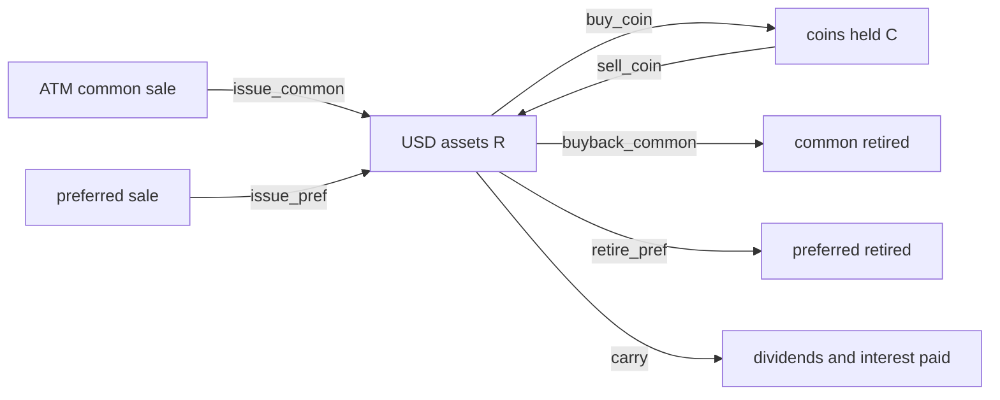

# What a Crypto Treasury Company Does

> Three public companies that hold coins, and the seven kinds of rows their capital moves become.

**Type:** Concept
**Files:** `data/actions.csv`, `dat/parse_mstr.py` (`ACTION_FIELDS`), `dat/balances.py` (`CONVERTS`), `.claude/rules/method.md`
**Prerequisites:** None
**Time:** ~25 minutes

## Learning Objectives

- Name the three firms, their tickers and the coin each one holds
- Describe each way these firms raise or return capital: ATM common sales, perpetual preferred, convertible notes, buybacks, coin trades, dividends
- Map each of those moves to one `action` value in `data/actions.csv`
- Count the rows per firm and action type from the committed CSV and read one real row of each type

## The Problem

A crypto treasury company is a listed company whose main asset is a pile of coins. Its share price floats on the stock market, separate from the coin price. Every week it can sell new stock, buy stock back, sell or retire preferred stock, and buy or sell coins. Each of these moves changes how many coins stand behind one share.

The project measures those moves. Before any math, it needs one list of every move, in one format, where each row says which filing it came from. Without that list, a number on the page can't be traced back to a source, and a move missed in parsing would silently change every result after it.

## The Concept

The three firms:

| firm | ticker | CIK | coin | coins held, latest stated |
|---|---|---|---|---|
| Strategy | MSTR | 1050446 | BTC | 846,000 (2026-09-20) |
| BitMine | BMNR | 1829311 | ETH | 5,983,940 (2026-09-20) |
| SharpLink | SBET | 1981535 | ETH | 888,938 (2026-08-03) |

A CIK is the SEC's ID number for a company; lesson 00-02 uses it to find the filings.

The ways they raise and return capital, with the finance terms defined:

- **Common stock, sold at the market (ATM).** An at-the-market program lets a firm sell new shares into the market through brokers, a little at a time. Strategy's 8-Ks report each week's ATM sales by ticker with net proceeds, "net of sales commission". SharpLink sold common in a registered direct offering on 2026-06-23.
- **Perpetual preferred stock.** Preferred stock ranks ahead of common: its holders get a fixed dividend and are owed a set amount, the liquidation preference, before common holders get anything. Perpetual means it has no maturity date. The project counts it at notional, $100 per share (STRE's notional is in euros, €775M, converted at `EURUSD = 1.147` in `dat/balances.py`). Strategy has five: STRF (10.00%), STRC (variable rate), STRK (8.00%, converts to 0.1 MSTR share), STRD (10.00%) and STRE (10.00%, in euros). BitMine has one: BMNP, 9.50% cumulative on $100, paid weekly in cash, issued 2026-06-10 at $80. SharpLink has none.
- **Convertible notes.** A convertible note is debt the holder can swap for common shares at a set conversion price. Strategy has six, listed in `CONVERTS` in `dat/balances.py`, from the 2028 note ($1,010M at $183.19) to the 2032 note ($800M at $204.33).
- **Buybacks and retirements.** Buying back common reduces the share count. Retiring preferred (Strategy's word is repurchasing) removes preferred notional. Strategy retired STRC in 9 weeks; BitMine bought back BMNR in 5.
- **Coin trades.** Buying coins moves dollars into coins; selling does the reverse.
- **Dividends and interest.** Cash paid to preferred and note holders. Strategy keeps a USD Reserve that its 8-Ks say "remains designated to support payment of preferred stock dividends and interest on outstanding indebtedness".



Every arrow is one `action` value. `carry` is not an action: it records dividends and interest paid out of R (and, for SharpLink, inferred staking added to C), so that the week's parts add up to the observed change. `actions.csv` has no row for a convertible note; notes enter the math through D or S (lesson 00-03).

## Build It

### Step 1: The schema

Every parser writes the same columns. From `dat/parse_mstr.py`:

```python
ACTION_FIELDS = ['firm', 'week_end', 'filed', 'filing_url', 'action', 'ticker', 'usd', 'units', 'avg_price', 'note']  # note: blank = filed figure
```

`units` is shares for common, notional dollars for preferred, coins for coin trades. `usd` and `units` are positive magnitudes and the action gives direction; `carry` rows are signed.

### Step 2: Count the rows

```python
import csv, collections
rows = list(csv.DictReader(open('data/actions.csv')))
count = collections.Counter((r['firm'], r['action']) for r in rows)
for (firm, action), n in sorted(count.items()):
    print(f'{firm:5} {action:15} {n:3}')
print(len(rows), 'rows')
```

Run from the repo root with `.venv/bin/python`:

```
BMNR  buy_coin         17
BMNR  buyback_common    5
BMNR  carry            14
BMNR  issue_pref        1
MSTR  buy_coin          5
MSTR  carry             4
MSTR  issue_common     13
MSTR  retire_pref       9
MSTR  sell_coin         5
SBET  buy_coin          1
SBET  buyback_common    1
SBET  carry             3
SBET  issue_common      1
79 rows
```

The counts show the two opposite trades the project was built around. Strategy sold common (13 rows) and retired STRC (9 rows). BitMine sold BMNP once and bought back common (5 rows). Strategy has no `issue_pref` or `buyback_common` row in this period.

### Step 3: One row of each type

```python
import csv
seen = set()
for r in csv.DictReader(open('data/actions.csv')):
    if r['action'] not in seen:
        seen.add(r['action'])
        print(r['firm'], r['week_end'], r['action'], r['ticker'], r['usd'], r['units'], r['avg_price'], sep=' | ')
```

```
BMNR | 2026-05-31 | buy_coin | ETH | 53326823.227907 | 26497 | 2012.560789
BMNR | 2026-06-14 | issue_pref | BMNP | 273800000 | 350000000 | 80
BMNR | 2026-06-28 | carry | DIV | -1108334.5 | 0 | 
BMNR | 2026-07-19 | buyback_common | BMNR | 85885800 | 5500000 | 15.6156
MSTR | 2026-05-31 | issue_common | MSTR | 128300000 | 801994 | 159.976259
MSTR | 2026-05-31 | sell_coin | BTC | 2500000 | 32 | 77135
MSTR | 2026-07-26 | retire_pref | STRC | 25000000 | 28893000 | 86.526148
```

Read the BMNP row: 3.5M shares at $80 raised $273.8M net, and added $350,000,000 of notional ($100 per share). Read the STRC row: $25.0M of cash retired $28,893,000 of notional, an average of $86.53 per $100 share. The first BitMine `buy_coin` row has a `usd` with six decimals because BitMine states purchases in ETH only; the dollars are units × that week's ETH close, and the row's `note` says so.

### Step 4: Every row traces to a filing

```python
import csv
rows = list(csv.DictReader(open('data/actions.csv')))
print('rows with a filing_url:', sum(1 for r in rows if r['filing_url']), 'of', len(rows))
print('distinct filings:', len({r['filing_url'] for r in rows}))
print('negative usd outside carry:', [r for r in rows if r['action'] != 'carry' and float(r['usd']) < 0])
print('carry usd range:', min(float(r['usd']) for r in rows if r['action'] == 'carry'),
      max(float(r['usd']) for r in rows if r['action'] == 'carry'))
```

```
rows with a filing_url: 79 of 79
distinct filings: 40
negative usd outside carry: []
carry usd range: -57400000.0 0.0
```

The zero at the top of the carry range is SharpLink's inferred staking rows, which add ETH (`units`) and no dollars.

## Use It

- `dat/engine.py` reads `actions.csv` in file order and applies each row to the week's state (lesson 00-04 and phase 01).
- The page's attribution bars draw one bar per action row, and each bar links to the row's `filing_url`.
- `check.py` check 5 fetches every unique `filing_url` from EDGAR and fails if any does not return.

## Ship It

The artifact is `data/actions.csv`, written by `dat/parse_mstr.py`, `dat/parse_bmnr.py` and `dat/parse_sbet.py`. The parser tests pin its format:

```
.venv/bin/python -m pytest -q tests/test_parse_mstr.py tests/test_parse_bmnr.py tests/test_parse_sbet.py
```

## Decisions

```widget
decisions L1,S7,S9,B4,B6,L8
```

## What Went Wrong

- Notes #3: many Strategy 8-Ks say dividends were paid without stating the amount. No amount was guessed, which is why MSTR has only 4 `carry` rows.
- Notes #5: USD Cash appeared on 2026-08-23 as a $1.59B jump in R. A special row was first added for it, then removed when the 8-K showed that week's MSTR sale proceeds funded it, already booked as `issue_common`.

## Exercises

1. Run the Step 2 snippet with `r['ticker']` in place of `r['firm']` and list which preferred tickers appear in `actions.csv`.
2. Sum `usd` over MSTR `issue_common` rows and over MSTR `retire_pref` rows. Say what share of the common proceeds went to STRC retirements, as a figure only.
3. For each BMNR `buy_coin` row, divide `usd` by `units` and compare with that week's `p` in `data/weekly.csv`. Explain why they match, and why that estimate does not move n (hint: lesson 00-04, action 5).
