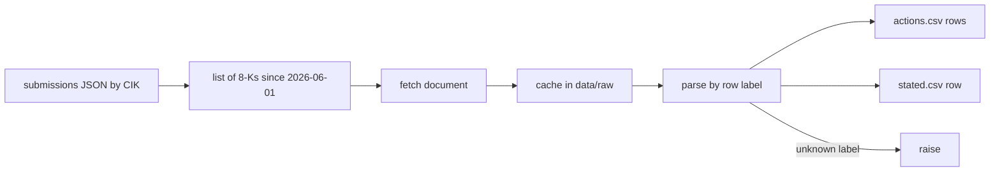

# Reading an 8-K

> Every row in the CSVs starts as a sentence or a table row in an SEC filing.

**Type:** Build
**Files:** `dat/edgar.py`, `dat/parse_mstr.py`, `dat/parse_bmnr.py`, `data/actions.csv`, `data/stated.csv`, `.claude/rules/data.md`
**Prerequisites:** 00-01
**Time:** ~35 minutes

## Learning Objectives

- Say what an 8-K, 10-Q, FWP and 424B are, and which one the project reads for each figure
- Build an EDGAR document URL from a CIK and an accession number
- Map each table row of Strategy's 8-K filed 2026-08-24 to its row in `actions.csv` or `stated.csv`
- Contrast Strategy's labeled tables with BitMine's prose release, and say how each parser fails loudly
- State the EDGAR fair-access rules the client follows

## The Problem

The firms don't publish a spreadsheet of their capital moves. They file documents with the SEC, and each firm writes them its own way. Strategy puts its weekly numbers in labeled tables. BitMine writes a press release in paragraphs. SharpLink files only now and then.

If a parser reads a table by column position, a new column or a moved table puts a number in the wrong place with no error. If it skips a sentence it does not recognize, a trade goes missing and every week after it is wrong. The project's rule is that an unknown label raises.

## The Concept

The filing types, in plain terms:

| form | what it is | what the project takes from it |
|---|---|---|
| 8-K | a current report, filed within days of an event | Strategy's weekly ATM sales, STRC repurchases, BTC trades, USD Reserve and USD Cash |
| ex99-1 | exhibit 99.1, a press release attached to an 8-K | BitMine's weekly ETH held, cash, buybacks, BMNP sale |
| 10-Q | the quarterly report with the balance sheet | share counts, each preferred's notional, converts: the anchors |
| FWP | free writing prospectus, offering material filed with the SEC | the glossary in Strategy's 2026-08-24 FWP that defines net coins per share |
| 424B | prospectus supplement with an offering's final terms | BMNP terms, checked in Step 0 |

EDGAR is the SEC's filing system. It identifies each company by a CIK (Strategy 1050446, BitMine 1829311, SharpLink 1981535) and each filing by an accession number such as `0001193125-26-361845`. A document's URL is the CIK, the accession number with the dashes removed, and the file name.



## Build It

### Step 1: The EDGAR client

`dat/edgar.py` sends every request with an identifying User-Agent and waits at least 0.6 s between requests, which keeps it under the SEC's 10 requests per second. From `SECClient.get`:

```python
    def get(self, url):
        for wait in (*self.BACKOFF, None):
            delay = 0.6 - (time.monotonic() - self.last_request)
            if delay > 0:
                time.sleep(delay)
            self.last_request = time.monotonic()
            request = urllib.request.Request(url, headers={'User-Agent': self.user_agent, 'Accept-Encoding': 'identity'})
```

The User-Agent is `UA = 'dat-accretion rbhavanzim@gmail.com'`. HTTP 429 and 503 are retried after 5, 15 and 45 s, then the run fails; any other error fails at once. `fetch()` caches each document at `data/raw/<accession>/<doc>`, which is gitignored and rebuildable, so a second run makes no request.

Listing and fetching needs network. Step 1 of the build ran it; the output below is from PR #3:

```
$ .venv/bin/python -m dat.parse_mstr
8-Ks read 24, skipped 7, parsed 17; actions.csv 36 rows, stated.csv 18 rows
```

### Step 2: One Strategy 8-K

Take the 8-K filed 2026-08-24 for the week ending 2026-08-23: `https://www.sec.gov/Archives/edgar/data/1050446/000119312526361845/mstr-20260824.htm`. Its Item 8.01 has five sections: a Digital Credit Capital Framework update, USD Reserve and USD Cash balances, an ATM table, a BTC table and a repurchase table. With the HTML tags removed, the lines the parser reads are:

```
USD Reserve: $5.10 billion
USD Cash: $1.59 billion
MSTR Stock 18,261,118 $ - $ 2,006.5 (4) $ 19,694.2
- $ - $ - 840,447 $ 63.36 $ 75,385 (1) No bitcoin purchases or sales were made this week.
STRC Stock (1) 1,431,212 $ 136.4
(4) $136.4 million in net proceeds from MSTR Stock sales were used to fund repurchases of STRC Stock under the Digital Credit Securities Repurchase Program (defined below), $300.0 million in net proceeds from MSTR Stock sales were used to increase the USD Reserve ...
```

Each maps to one field:

| filing | CSV |
|---|---|
| ATM table, row `MSTR Stock`: 18,261,118 shares, $2,006.5M net proceeds | `actions.csv`: `issue_common`, usd 2006500000, units 18261118, avg_price 109.878267 |
| Repurchase table, row `STRC Stock`: 1,431,212 shares, $136.4M | `actions.csv`: `retire_pref`, usd 136400000, units 143121200 (shares × $100), avg_price 95.30384 |
| BTC table: Aggregate BTC Holdings 840,447 | `stated.csv`: coins 840447 |
| USD Reserve $5.10 billion, USD Cash $1.59 billion | `stated.csv`: usd_reserve 5100000000, usd_cash 1590000000, both `_prec` 10000000 |
| footnote (4): $300.0 million to the USD Reserve | `stated.csv`: reserve_in 300000000 |

`_prec` is the unit in the last digit shown: "$5.10 billion" is exact to $10M.

### Step 3: Parse it yourself

The repurchase table goes through `repurchase()` in `dat/parse_mstr.py`, which turns preferred shares into notional:

```python
    for t, v in table:
        shares, usd = v['sharesrepurchased'], v['aggregatepurchaseprice(inmillions)'] * SCALE['million']
        if shares == 0 and usd == 0:
            continue
        if t == 'MSTR':
            out.append((end, 'buyback_common', t, usd, shares, usd / shares))
        elif t == 'STRE':
            raise ValueError(f'{where}: STRE retirement is EUR; no USD rate parser for it, add one from this filing')
        else:
            out.append((end, 'retire_pref', t, usd, shares * STATED_AMOUNT, usd / shares))
```

With the filing cached in `data/raw/`, parsing runs offline:

```python
from dat.parse_mstr import parse
from dat.edgar import fetch
url = 'https://www.sec.gov/Archives/edgar/data/1050446/000119312526361845/mstr-20260824.htm'
acts, stated = parse(fetch(url), {'accession': '0001193125-26-361845', 'url': url, 'filed': '2026-08-24'})
for a in acts: print(a['action'], a['ticker'], a['usd'], a['units'], a['avg_price'])
for s in stated: print(s['week_end'], s['coins'], s['usd_reserve'], s['usd_cash'], s['reserve_in'], s['usd_reserve_prec'])
```

```
issue_common MSTR 2006500000 18261118 109.878267
retire_pref STRC 136400000 143121200 95.30384
2026-08-23 840447 5100000000 1590000000 300000000 10000000
```

The output matches the committed rows. Without the cache, `fetch()` makes one EDGAR request.

### Step 4: A BitMine release is prose

BitMine's ex99-1 for the same week has no trade table. The facts sit in sentences:

> As of August 23, 2026 at 2:00pm ET, the Company’s crypto holdings are comprised of 5,847,611 ETH at $2,440 per ETH ... and total cash & marketable securities of $308 million.

> Over the past week, we acquired 32,447 ETH.

`dat/parse_bmnr.py` reads them with regular expressions:

```python
HOLDINGS = (rf'As of ({DATE})(?: at [^,]+)?, the Company{AP}s crypto holdings are comprised of ([\d,]+) ETH\b'
            rf'.*? and total cash(?: & marketable securities)? of {MONEY}')
ACQUIRED = r'\bwe acquired ([\d,]+) ETH\b'
```

Prose gives a parser more ways to miss something, so `check_near()` scans every sentence that mentions a repurchase, offering, purchase or sale, and raises on any number that no known phrase consumes. Parsing the cached release:

```python
from dat.parse_bmnr import parse
from dat.edgar import fetch
url = 'https://www.sec.gov/Archives/edgar/data/1829311/000149315226039789/ex99-1.htm'
r = parse(fetch(url), {'accession': '0001493152-26-039789'}, url)
print({k: r[k] for k in ('week_end', 'coins', 'cash', 'cash_prec', 'acquired', 'staked', 'buyback', 'pref')})
```

```
{'week_end': '2026-08-23', 'coins': Decimal('5847611'), 'cash': Decimal('308000000'), 'cash_prec': Decimal('1000000'), 'acquired': Decimal('32447'), 'staked': Decimal('5067309'), 'buyback': None, 'pref': []}
```

The release gives ETH bought in coins only. The `buy_coin` row's usd, 81,603,152.99, is 32,447 × $2,514.97, the CoinGecko ETH close for the week's price date, 2026-08-21, and its `note` says "usd estimated: units × ETH close". The release's own $2,440 is a 2:00pm ET price and is not used.

## Use It

- Every `actions.csv` row carries its `filing_url`; each dot on the page's map and each attribution bar links to it.
- `stated.csv` coins are the target for the Step 1 check: each week's rolled BTC must equal the 8-K's stated holdings exactly.
- `check.py` check 5 fetches every unique `filing_url` through the same client and throttle.
- The weekly `refresh.yml` workflow reruns the parsers on new filings; the cache in `data/raw/` persists across runs.

## Ship It

This step produced `dat/edgar.py`, `dat/parse_mstr.py`, `dat/parse_bmnr.py` and the rows in `actions.csv` and `stated.csv`. The offline tests cover the parsers and the retry rule:

```
.venv/bin/python -m pytest -q tests/test_parse_mstr.py tests/test_parse_bmnr.py tests/test_edgar.py
```

```
53 passed in 0.16s
```

## Decisions

```widget
decisions S1,S2,S3,S11,S12,B7,B8,L9,O6,O7
```

## What Went Wrong

- Notes #2: two Strategy 8-Ks (filed 6/15 and 8/03) disagree with the next week's holdings by 1 BTC. The check stayed exact; both weeks are listed in `KNOWN_FILING_GAPS` with the arithmetic.
- Notes #9: one BitMine release is dated "As of June 28" but reports July 5 holdings; `KNOWN_DATE_ERRATA` assigns it to 2026-07-05.
- Notes #16: parsers skipped trades silently in edge cases. Three review rounds replaced word lists with structural rules, such as the `check_near()` scan above.
- Notes #18: a quick scan split sentences on the period in "$5.04" and "U.S." and produced empty output.

## Exercises

1. Pick a different MSTR week from `data/stated.csv`, rerun the Step 3 snippet with its `filing_url` and accession, and confirm the rows match `actions.csv`. If the filing is not cached, the run needs network.
2. In `data/actions.csv`, check that every MSTR `retire_pref` row's `units` equals shares × 100 by dividing `usd` by `avg_price` and multiplying by 100.
3. Copy the cached 8-K to your scratch folder, replace every `STRC Stock` with `STRX Stock`, and run `parse()` on the edited text. Confirm it raises "unknown security row" instead of dropping the row.
