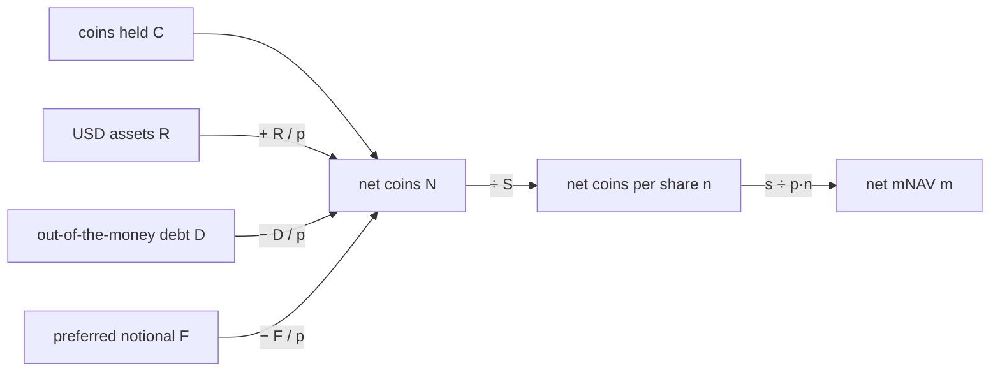

# The Ruler: Net Coins per Share

> One number for three firms, taken from the firm that defined it.

**Type:** Build
**Files:** `dat/balances.py` (`net()`), `data/balances.csv`, `data/weekly.csv`
**Prerequisites:** 00-01, 00-02
**Time:** ~30 minutes

## Learning Objectives

- Compute net coins N, net coins per share n and net mNAV m from five balance-sheet figures and two prices
- Explain why an in-the-money convert leaves D and joins S
- Reproduce one row of `data/weekly.csv` by hand from `data/balances.csv`
- Say where the definition comes from and why the project uses it for all three firms

## The Problem

To compare a stock sale with a preferred retirement, or Strategy with BitMine, every action needs the same unit. Dollars don't work: a $100M sale means something different at a $50B firm than at a $5B one. Coins held per share don't work either, because they ignore the debt and preferred that rank ahead of common stock.

Strategy already publishes a metric that nets those claims out: net sats per share. If this project invented its own ruler, every result would start an argument about the ruler. Using the firm's own definition removes that argument.

## The Concept

The definition comes from the glossary in Strategy's 2026-08-24 FWP. Per firm, per week:

```
N = C + (R − D − F) / p      net coins
n = N / S                    net coins per share
m = s / (p · n)              net mNAV
```

| symbol | meaning | Strategy, week ending 2026-09-20 |
|---|---|---|
| C | coins held | 846,000 BTC |
| R | USD assets: USD Reserve plus USD Cash | $6.09B |
| D | notional of out-of-the-money converts | $5.91B |
| F | preferred notional ($100 per share, not trading price) | $14.29B |
| S | fully diluted shares | 429,366,277 |
| p | coin close | $80,873.58 |
| s | common close | $153.92 |

```widget
ruler
```



Two rules come straight from the glossary and matter every week:

- **In the money moves a convert.** A convertible note whose conversion price is below the MSTR price will likely become shares. It leaves D and its shares (face ÷ conversion price) join S. The test runs at each date's price, so the 2030A note ($800M, $149.77) moves back and forth.
- **Fully diluted, not assumed diluted.** Net sats per share uses Fully Diluted shares (about 430M). Strategy's gross sats per share uses Assumed Diluted shares (about 450M, every convert converted). The two are never mixed.

## Build It

### Step 1: Read the function

`dat/balances.py` holds the whole definition in one function:

```python
def net(coins, usd_assets, converts, prefs, basic_shares, awards, p, s):
    """converts: list of (face_usd, conv_price). prefs: list of (notional_usd, conv_price_or_None, shares_if_converted_or_0).
    Returns dict: D, F, S, N (net coins), n (net coins per share), net_sats_per_share (n*1e8),
    net_reserve_usd (N*p), amplification (coins*p / (N*p)), mnav (s / (N*p/S))."""
    D, F, S = 0.0, 0.0, basic_shares + awards
    for face, cp in converts:
        if s > cp:
            S += face / cp
        else:
            D += face
    for notional, cp, shares in prefs:
        if cp is not None and s > cp:
            S += shares
        else:
            F += notional
    N = coins + (usd_assets - D - F) / p
    n = N / S
    return {'D': D, 'F': F, 'S': S, 'N': N, 'n': n, 'net_sats_per_share': n * 1e8,
            'net_reserve_usd': N * p, 'amplification': coins / N, 'mnav': s / (N * p / S)}
```

Everything else in the project either feeds this function or measures how its output changes.

### Step 2: Recompute one week by hand

Take the week's balances and prices from the committed CSVs and apply the three lines:

```python
import csv
b = next(r for r in csv.DictReader(open('data/balances.csv')) if r['firm'] == 'MSTR' and r['date'] == '2026-09-20')
w = next(r for r in csv.DictReader(open('data/weekly.csv')) if r['firm'] == 'MSTR' and r['week_end'] == '2026-09-20')
C, R, D, F, S = (float(b[k]) for k in ('coins', 'usd_reserve', 'debt', 'pref_notional', 'shares_diluted'))
p, s = float(w['p']), float(w['s'])
N = C + (R - D - F) / p
n = N / S
m = s / (p * n)
print(f'N = {N:,.0f} BTC   n = {n:.10f}   sats/share = {n*1e8:,.0f}   m = {m:.6f}')
print(f"weekly.csv:  n = {w['n']}   m = {w['m']}")
```

Run it from the repo root with `.venv/bin/python`:

```
N = 671,441 BTC   n = 0.0015637946   sats/share = 156,379   m = 1.217051
weekly.csv:  n = 0.001563794558   m = 1.217051
```

The claims ahead of common (R − D − F = −$14.12B) are worth 174,559 BTC at $80,874, so 846,000 BTC held becomes 671,441 BTC net.

### Step 3: Check it against Strategy

Step 0 of the build rebuilt Strategy's own figure from the filings and compared it with the live KPI API. The test `tests/test_balances.py` pins the result against the snapshot taken 2026-09-25T16:19:32Z:

```
net_sats_per_share   rebuilt 157899.6146  API 157730.9538  err +0.107%
net_reserve_usd      rebuilt 56959456000  API 56961379020  err -0.003%
amplification        rebuilt 1.2478       API 1.2478       err +0.004%
mnav                 rebuilt 1.1980       API 1.1994       err -0.114%
```

The gate was 0.5%, so levels are computed from filings rather than copied from the API.

## Use It

- `data/weekly.csv` holds n and m for every firm-week; the break-even map plots m.
- The memo's first paragraph states this definition in one paragraph.
- `check.py` checks 1 and 2 rerun this rebuild against the live API every day.

## Ship It

This step produced `net()` and the pinned rebuild test. Run it:

```
.venv/bin/python -m pytest -q tests/test_balances.py
```

## Decisions

```widget
decisions R1,R2,R3,R4,R5,R6,R7
```

## Exercises

1. Change the week in Step 2 to `2026-08-23` and confirm your m matches `data/weekly.csv`.
2. Using the `CONVERTS` list in `dat/balances.py`, find the MSTR price at which the 2030A note moves into S, then find a week in `data/weekly.csv` on each side of it.
3. Compute how n would change for the 9/20 week if the $39.8M secured term loan were deducted, and say why the definition leaves it out.
