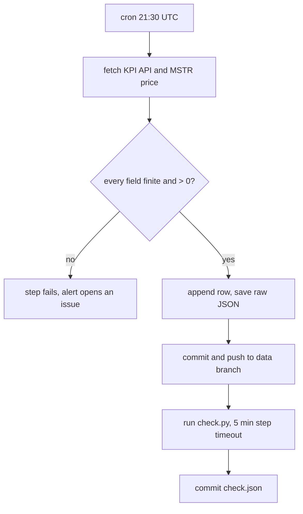

# Saving an API With No History

> An API that only knows today needs a job that writes today down, every day, and never erases it.

**Type:** Build
**Files:** `dat/snapshot_kpi.py`, `.github/workflows/snapshot.yml`, `tests/test_snapshot_kpi.py`, the `data` branch (`data/kpi_snapshots.csv`, `data/kpi/<date>.json`)
**Prerequisites:** 00-03
**Time:** ~25 minutes

## Learning Objectives

- Explain why the KPI snapshot shipped before any analysis code
- Validate an API field as a finite number above zero and name the four bad values `positive()` rejects
- Describe the order of steps in `snapshot.yml` and why the KPI row commits before `check.py` runs
- State the two rules for the `data` branch: append-only commits, never force-push

## The Problem

Strategy publishes its own net sats per share, mNAV and amplification at `https://api.strategy.com/btc/bitcoinKpis`. (mNAV is the share price divided by the net coin value per share; lesson 00-03 defines it.) The API returns only the current value. There is no history endpoint, so yesterday's figure is gone unless someone saved it yesterday.

That makes the snapshot the one part of the project that cannot be rebuilt later. Parsers can be rewritten and rerun against the same filings for years. A day without a saved KPI row is lost for good. So the build started here, in PR #1, before any parser existed (decision P7).

A daily job that writes to a branch has its own failure modes. A force-push, or a job that dies halfway, can erase rows that exist nowhere else. The design below is about those failures as much as about the fetch.

## The Concept

Each day at 21:30 UTC, after the US close, a GitHub Actions job fetches two things: the KPI JSON and the MSTR price from Yahoo. It checks every field it keeps, appends one CSV row, saves the whole raw JSON, and commits both to the `data` branch.



Three rules hold it together:

- **Append-only, never force-push.** The `data` branch belongs to the bot. Each run adds a commit on top of the last one. The workflow comment says it plainly: "append-only; never force-push, the API keeps no history". The author's earlier project, Spine, force-pushed its data branch; this one differs on purpose (decision P6).
- **Keep the raw payload.** The CSV keeps six numbers. The API sends 77 fields in `results`, including `satsPerShare` (the gross figure that uses a different share count). The raw JSON for each day is saved to `data/kpi/<date>.json` in case a later step needs a field the CSV drops.
- **Fail loudly on bad input.** A missing field, a zero, a string like `'157,712'` or a NaN would poison the series. `positive()` raises instead of writing it.

## Build It

### Step 1: Validate each field

From `dat/snapshot_kpi.py`:

```python
def positive(name, v):
    if isinstance(v, bool) or not isinstance(v, (int, float)) or not math.isfinite(v) or v <= 0:
        raise ValueError(f'{name}: expected a finite number > 0, got {v!r}')
    return v


def row(kpi, chart, fetched_at):
    """One kpi_snapshots.csv row; raises ValueError on any missing or non-positive field."""
    r = kpi['results']
    out = {'fetched_at': fetched_at}
    for k in ('netSatsPerShare', 'netBtcReserve', 'amplification', 'mNav'):
        out[k] = positive(k, r.get(k))
    out['btc_price'] = positive('btc_price', r.get('latestPrice'))
    out['mstr_price'] = positive('mstr_price', chart['chart']['result'][0]['meta'].get('regularMarketPrice'))
    return out
```

The `bool` test comes first because Python treats `True` as the integer 1. Try each case from the repo root:

```
.venv/bin/python -c "
from dat.snapshot_kpi import positive
for v in (157730.9538, float('nan'), 0, '157,712', True):
    try: print(repr(v), '->', positive('netSatsPerShare', v))
    except ValueError as e: print(repr(v), '->', 'ValueError:', e)
"
```

```
157730.9538 -> 157730.9538
nan -> ValueError: netSatsPerShare: expected a finite number > 0, got nan
0 -> ValueError: netSatsPerShare: expected a finite number > 0, got 0
'157,712' -> ValueError: netSatsPerShare: expected a finite number > 0, got '157,712'
True -> ValueError: netSatsPerShare: expected a finite number > 0, got True
```

### Step 2: Append, don't rewrite

`save()` opens the CSV in append mode, writes the header only when the file is new, and writes `\n` line endings (Python's `csv` default is CRLF; build note #17). Feed it the real 2026-09-26 payload from the `data` branch twice, in a scratch directory:

```
git show origin/data:data/kpi/2026-09-26.json > kpi.json
.venv/bin/python -c "
import json
from dat.snapshot_kpi import row, save
kpi = json.load(open('kpi.json'))
chart = {'chart': {'result': [{'meta': {'regularMarketPrice': 158.61}}]}}
r = row(kpi, chart, '2026-09-26T12:41:03Z')
save('kpi_demo', r, kpi)
save('kpi_demo', r, kpi)
"
cat kpi_demo/kpi_snapshots.csv; ls kpi_demo/kpi
```

```
fetched_at,netSatsPerShare,netBtcReserve,amplification,mNav,btc_price,mstr_price
2026-09-26T12:41:03Z,157758.0352,57010658520,1.2476,1.1971,84074,158.61
2026-09-26T12:41:03Z,157758.0352,57010658520,1.2476,1.1971,84074,158.61
2026-09-26.json
```

Two runs give two CSV rows but one JSON file: the raw file is named by date, so a second run on the same day replaces it.

### Step 3: Commit the row before anything else can fail

From `.github/workflows/snapshot.yml`:

```yaml
      - name: fetch today's KPI row and raw JSON
        timeout-minutes: 3   # a stalled API fails this step (alert fires) instead of cancelling the job (no alert)
        run: python -m dat.snapshot_kpi _data/data
      - name: commit and push the KPI row first (append-only; never force-push, the API keeps no history)
        id: push_kpi
        working-directory: _data
        run: |
          git config user.name dat-bot
          git config user.email dat-bot@users.noreply.github.com
          git add data
          git commit -m "data: KPI snapshot $(date -u +%F)"
          git push origin data
```

The `data` branch is checked out as a worktree in `_data`, and on the very first run it is created as an orphan branch. The push is a plain `git push`. If someone else's commit got there first, the push fails rather than overwriting it.

### Step 4: Look at the real rows

This needs network for the fetch:

```
git fetch origin data
git log origin/data --oneline | head
git show origin/data:data/kpi_snapshots.csv
```

```
2ea2cd3 data: done check 2026-09-26
8d58113 data: KPI snapshot 2026-09-26
ed91263 data: KPI snapshot 2026-09-25
2aa6dca data: KPI snapshot 2026-09-25
fetched_at,netSatsPerShare,netBtcReserve,amplification,mNav,btc_price,mstr_price
2026-09-25T16:19:32Z,157730.9538,56961379020,1.2478,1.1994,84015,158.93
2026-09-25T23:58:29Z,157744.0645,56985227760,1.2477,1.1971,84044,158.61
2026-09-26T12:41:03Z,157758.0352,57010658520,1.2476,1.1971,84074,158.61
```

The first row, 2026-09-25T16:19:32Z, is the snapshot that `tests/test_balances.py` pins the Step 0 rebuild against.

## Use It

- `tests/test_balances.py` compares the rebuild from filings with the 2026-09-25T16:19:32Z row: netSatsPerShare +0.107%, mNAV −0.114%.
- `check.py` checks 1 and 2 reuse `get_json` and `positive` from this module to compare the rebuild with the live API.
- The same workflow commits `data/check.json`, which the page reads for its check status.

## Ship It

PR #1 shipped the module, the workflow and CI. Its acceptance output:

```
$ .venv/bin/python -m pytest -q
5 passed in 0.02s

$ .venv/bin/python -m dat.snapshot_kpi <scratch>/kpi_test
fetched_at,netSatsPerShare,netBtcReserve,amplification,mNav,btc_price,mstr_price
2026-09-25T16:17:29Z,157760.4277,57015015420,1.2476,1.2004,84079,159.24
```

The offline check today:

```
.venv/bin/python -m pytest -q tests/test_snapshot_kpi.py
```

```
.....                                                                    [100%]
5 passed in 0.08s
```

## Decisions

```widget
decisions P6,P7,O1,O2,O5
```

## What Went Wrong

- **#20.** `check.py` first ran before the KPI commit. A slow EDGAR could push the job past its timeout, and GitHub cancels a timed-out job rather than failing it, so both the commit and the alert would be skipped. PR #8 moved the commit first and gave `check.py` a 5-minute step timeout inside the job's 10 and the fetch a 3-minute one.
- **#21.** `git show ... > data/check.json || true` left a 0-byte file when the branch had none, which would have broken the first Pages deploy. The file is now written to a temp path and moved, and `build_site` tolerates a missing or invalid one.
- **#17.** The CSV writer defaulted to CRLF line endings; every writer now passes `lineterminator='\n'`.

## Exercises

1. **Run it.** Run `.venv/bin/python -m pytest -q tests/test_snapshot_kpi.py`, then load `git show origin/data:data/kpi/2026-09-25.json` and list three fields in `results` that the CSV does not keep.
2. **Modify it.** Add `btcHoldings` to the CSV. Its value in the raw JSON is the string `"846,000"`. Decide whether it goes through `positive()` as is, and write the smallest change that keeps the "finite number > 0" rule.
3. **Break it.** In a scratch copy of `snapshot.yml`, move the `done check` step above `push_kpi`. If `check.py` hangs for 12 minutes, the step's own `timeout-minutes: 5` ends it and `continue-on-error: true` lets the push run, within the job's `timeout-minutes: 10`. Now also delete the step's `timeout-minutes: 5` and write down what happens to that day's row.
