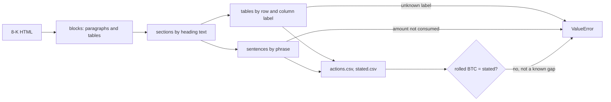

# Parsing Filings by Label, Failing Loudly

> A parser that skips what it doesn't recognize produces clean, wrong data. Make it raise instead.

**Type:** Build
**Files:** `dat/parse_mstr.py`, `dat/parse_bmnr.py`, `tests/test_parse_mstr.py`, `tests/test_parse_bmnr.py`, `data/actions.csv`, `data/stated.csv`
**Prerequisites:** 00-03, 01-01
**Time:** ~40 minutes

## Learning Objectives

- Read a table by row and column label and explain what positional parsing gets wrong
- Recompute the two 1-BTC gaps in `KNOWN_FILING_GAPS` from their filings' figures
- Show why `sentences()` must not split on the periods in "$5.04" and "U.S."
- Name the four structural guards on Strategy reserve sentences and the one on BitMine holdings, and trigger one with a real call

## The Problem

An 8-K is the form a US public company files with the SEC to report an event. Strategy files one most Mondays with tables of the past week: shares sold through its at-the-market (ATM) program, which sells stock into the market over time; preferred shares bought back; bitcoin bought or sold; and the balance of its USD Reserve, a cash account it keeps for dividends and interest. BitMine files a weekly press release (exhibit 99.1 to an 8-K) that says the same kinds of things in sentences.

Filings change shape. A new preferred ticker appears, a column gets renamed, a sentence uses a verb the parser has never seen. A parser that reads "the third column" or skips unknown rows keeps running and writes a wrong number into `actions.csv`. Nothing downstream can tell. The project rule (decision S1, `.claude/rules/data.md`): parse by row label, and an unknown label raises. No row is ever skipped silently, and no gap is filled with a guess (S2).

## The Concept



The acceptance check for Step 1 was exact: start from the first 8-K's holdings, add each week's buys and subtract its sales, and the result must equal the next 8-K's stated holdings to the coin. It did, in 16 of 18 weeks. The other two are places where Strategy's own filings disagree by 1 BTC:

| week | arithmetic | filing states | next filing balances from |
|---|---|---|---|
| 2026-06-14 | 845,256 + 1,587 = 846,843 | 846,842 (filed 6/15) | 846,843 (+520 = 847,363) |
| 2026-08-02 | 843,775 − 1,638 = 842,137 | 842,138 (filed 8/03) | 842,137 (−1,690 = 840,447) |

Rather than add a 1-BTC tolerance that would hide real misses, both weeks are listed by name with their arithmetic (decision S3). Any other 1-BTC miss still fails.

Word lists were the first approach for sentences: collect every phrasing that moves money into or out of the USD Reserve. Three review rounds each found a new phrasing the list missed (build note #16). The fix was structural rules that don't depend on the verb (decision S11):

1. Every `$` amount in a sentence that mentions the USD Reserve must fall inside a known phrase.
2. Every "USD Reserve" mention in such a sentence must sit inside a balance, capacity, inflow or outflow pattern.
3. A flow preceded by "up to", "may", "will", "not" and similar words raises as hypothetical or negated.
4. An "increase the USD Reserve" clause without its own amount, or a "remaining/rest" inflow, raises.

BitMine gets the same idea: a number near "repurchas", "offering", "acquired" and similar words must be consumed by a known phrase, and an ETH holdings change with no parsed "we acquired N ETH" sentence raises (decision B8).

## Build It

### Step 1: Read a table by label

From `security_table()` in `dat/parse_mstr.py`, each row must be a known ticker under a known header (unknown column headers raise the same way):

```python
        elif m := re.fullmatch(r'([A-Z]{4}) Stock(?: ?\(\d\))?', r[0]):
            t = m.group(1)
            if t != 'MSTR' and t not in PREFS or header is None or len(r) != len(header) + 1:
                raise ValueError(f'{where}: unknown security row {r!r}')
            out.append((t, dict(zip(header, map(num, r[1:])))))
```

Hand it a ticker that doesn't exist:

```
.venv/bin/python -c "
from dat.parse_mstr import security_table
security_table([['Security','Shares Sold'],['STRX Stock','100']], ['sharessold'], 'demo')"
```

```
ValueError: demo: unknown security row ['STRX Stock', '100']
```

### Step 2: Split sentences without breaking numbers

From `dat/parse_mstr.py`:

```python
SENTENCE = r'(?<![A-Z]\.[A-Z]\.)(?<!\b[A-Z]\.)(?<=\.)\s+(?=[A-Z(•●])'


def sentences(text):
    return re.split(SENTENCE, text)
```

A split needs a period, then whitespace, then a capital, "(" or a bullet, and not right after "U.S."-style initials. The period in "$5.04" is never followed by whitespace. Compare with a naive split:

```
.venv/bin/python -c "
import re
from dat.parse_mstr import sentences
t = 'The U.S. balance of the USD Reserve is \$5.04 billion. Next sentence.'
print(sentences(t))
print(re.split(r'\.\s+', t))"
```

```
['The U.S. balance of the USD Reserve is $5.04 billion.', 'Next sentence.']
['The U.S', 'balance of the USD Reserve is $5.04 billion', 'Next sentence.']
```

### Step 3: Trigger the reserve guards

`reserve_guard()` runs before any reserve amount is summed, on each sentence that mentions the USD Reserve. Its first two checks, from `dat/parse_mstr.py`:

```python
            for rx in (RESERVE_IN, RESERVE_OUT):
                for m in re.finditer(rx, s):
                    if h := re.search(HEDGE, s[max(0, m.start() - 40):m.start()], re.I):
                        raise ValueError(f'{where}: hypothetical or negated USD Reserve flow ({h.group(0)!r}) in {s!r}')
            if '$' in s:
                cover = [m.span() for rx in COVER for m in re.finditer(rx, s, re.I)]
                for m in re.finditer(r'USD Reserve', s):
                    if not any(a <= m.start() < b for a, b in cover):
                        raise ValueError(f'{where}: unknown USD Reserve flow: "USD Reserve" at char {m.start()} is not '
                                         f'part of a balance, capacity, inflow or outflow phrase in {s!r}')
```

Feed it three crafted sentences:

```
.venv/bin/python -c "
from dat.parse_mstr import reserve_guard
for s in ('Strategy may use up to \$50.0 million of the USD Reserve to pay future dividends.',
          'Strategy withdrew \$40.0 million from the USD Reserve to purchase bitcoin.',
          'The remaining proceeds were used to increase the USD Reserve.'):
    try: reserve_guard([('p', s)], 'demo')
    except ValueError as e: print('ValueError:', e)"
```

```
ValueError: demo: hypothetical or negated USD Reserve flow ('may') in 'Strategy may use up to $50.0 million of the USD Reserve to pay future dividends.'
ValueError: demo: unknown USD Reserve flow: "USD Reserve" at char 41 is not part of a balance, capacity, inflow or outflow phrase in 'Strategy withdrew $40.0 million from the USD Reserve to purchase bitcoin.'
ValueError: demo: unknown USD Reserve flow: an "increase the USD Reserve" clause without its own amount in 'The remaining proceeds were used to increase the USD Reserve.'
```

"withdrew" is in no list anywhere. The guard catches it because the "USD Reserve" mention sits in no known pattern.

The BitMine side has the same shape: `check_near()` in `dat/parse_bmnr.py` raises on any number near "repurchas", "offering" or "acquired" that no known phrase consumes, and `build()` raises when ETH holdings change with no "we acquired N ETH" sentence. `tests/test_parse_bmnr.py` covers both.

### Step 4: Roll the coins against the committed data

```
.venv/bin/python -c "
import csv
from dat.parse_mstr import roll
a=[r for r in csv.DictReader(open('data/actions.csv')) if r['firm']=='MSTR']
s=[r for r in csv.DictReader(open('data/stated.csv')) if r['firm']=='MSTR']
for w,ro,st,status in roll(a,s):
    if status!='OK' or w in ('2026-05-31','2026-06-21','2026-08-09'): print(w,ro,st,status)
print(sum(1 for x in roll(a,s) if x[3]=='OK'), 'OK of', len(s))"
```

```
2026-05-31 843706 843706 OK
2026-06-14 846843 846842 GAP
2026-06-21 847363 847363 OK
2026-08-02 842137 842138 GAP
2026-08-09 840447 840447 OK
16 OK of 18
```

The weeks after each gap balance exactly from the rolled figure, as the table in The Concept predicts.

## Use It

- `data/actions.csv` and `data/stated.csv` feed every later step. Every row carries `filing_url`, so each dot on the page links to its filing.
- The weekly refresh (`dat/refresh.py`) runs its `STEPS` in order: `dat.parse_mstr`, `dat.prices`, `dat.parse_bmnr`, `dat.parse_sbet`, then `dat.balances`, `dat.engine`, `dat.memo` and `dat.build_site`. A new phrasing stops the refresh with a `ValueError` naming the filing, instead of shipping a wrong week.

## Ship It

PR #3 (Strategy) and PR #5 (BitMine) shipped these parsers. PR #3's acceptance output:

```
$ .venv/bin/python -m dat.parse_mstr
8-Ks read 24, skipped 7, parsed 17; actions.csv 36 rows, stated.csv 18 rows
2026-05-31 rolled=843706 stated=843706 OK (anchor: start derived from this week)
... 15 more weeks OK ...
2026-06-14 rolled=846843 stated=846842 FILING GAP (documented)
2026-08-02 rolled=842137 stated=842138 FILING GAP (documented)
exit 0
```

`python -m dat.parse_mstr` needs EDGAR. The offline tests:

```
.venv/bin/python -m pytest -q tests/test_parse_mstr.py tests/test_parse_bmnr.py
```

```
..................................................                       [100%]
50 passed in 0.08s
```

## Decisions

```widget
decisions S1,S2,S3,S8,S11,S12,B8
```

## What Went Wrong

- **#16.** Parsers skipped trades silently in edge cases: a filing with trades but no BTC section, a STRE buyback, and phrasings outside a word list. A reviewer found these over three rounds. Structural rules replaced the word lists.
- **#18.** A quick scan split sentences on the period in "$5.04" and "U.S." and produced empty output. `sentences()` now handles both, with a test.

## Exercises

1. **Run it.** Run the Step 4 roll, then change `KNOWN_FILING_GAPS` to an empty dict in the call (`roll(a, s, gaps={})`) and report what status the two weeks get.
2. **Modify it.** Write a sentence that moves money out of the USD Reserve with a verb not used in any test (for example "transferred"). Predict which guard raises, then call `reserve_guard` and check.
3. **Extend it.** STRE trades raise because they are in EUR and the filings state no rate (decision S8). Sketch what `atm()` would need to book one, and which filing figure you would require before writing it.
