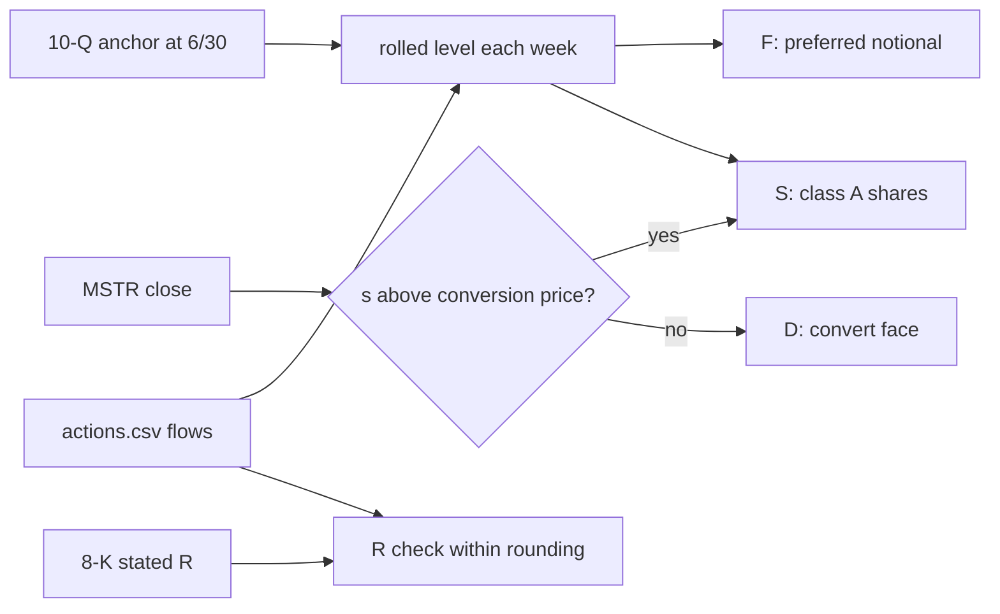

# Rolling Quarterly Anchors Forward

> Quarterly filings give levels, weekly filings give changes. Start from the level and add the changes, then check the result against every figure the filings do state.

**Type:** Build
**Files:** `dat/balances.py` (`rolled()`, `pref_notional()`, `class_a()`, `reserve_checks()`, `build()`), `dat/refresh.py`, `data/balances.csv`, `tests/test_balances.py`
**Prerequisites:** 00-03, 01-02
**Time:** ~35 minutes

## Learning Objectives

- Compute a level at any week from a quarterly anchor and dated changes, forward and backward, with `rolled()`
- Show which weeks the 2030A convert sits in D and which in S, from the MSTR close
- Compute the R check's tolerance from the last disclosed digit of two stated balances
- Explain why the $1.59B of USD Cash on 2026-08-23 gets no special row
- Say what `dat/refresh.py` exit code 2 means and why no code reanchors on its own

## The Problem

The ruler (lesson 00-03) needs five figures per week: coins C, USD assets R, debt D, preferred notional F and diluted shares S. The weekly 8-Ks state C and R. They don't state D, F or S. Those come from the 10-Q, the quarterly report with a full balance sheet, and Strategy's Q2 10-Q gives them as of 2026-06-30.

Two terms used below. **Preferred notional** is the stated amount per preferred share ($100 for STRC) times the shares outstanding; it is what ranks ahead of common, not what the shares trade at. A **convertible note** is debt the holder can swap for common shares at a fixed **conversion price**. When MSTR trades above that price the note is "in the money" and Strategy's definition counts it as shares, not debt.

A 10-Q every quarter and an 8-K every week means each weekly level has to be built: take the quarterly level and apply the week-by-week sales and repurchases the 8-Ks report (decision S10).

## The Concept



```widget
ruler
```

**Roll both ways.** The preferred anchor is 2026-06-30 and the class A anchor is the 10-Q cover date, taken as week 2026-07-26. Weeks before the anchor back the changes out; weeks after add them in. One function does both.

**Flip at each week's price.** The convert list is fixed; its split between D and S is not. Each week `net()` tests every note against that week's MSTR close (decision R3). In `data/balances.csv`, D is $5,913,659,000 on 2026-05-31 (MSTR $159.09) and 2026-09-20 ($153.92), and $6,713,659,000 in every other week. The $800M difference is the 2030A note, conversion price $149.77.

**R is taken as stated, and the roll is a check.** The first plan was to roll R the same way and require it to equal every 8-K. That could not pass: the filings round R to $10 to 50 million, and before August they don't itemize what flowed into it (build note #4). The rule decided 2026-09-25 (decision S4):

- R is each 8-K's stated USD Reserve plus USD Cash.
- From 2026-08-02, the week's change in R must match the week's flows within a tolerance: half a unit in the last disclosed digit of each of the two stated figures, summed. $5.10 billion has a last-digit unit of $10M, so ±$5M; $4.0 billion has $100M, so ±$50M.
- Before 2026-08-02 there is no check. Each week prints its unexplained change, labeled, and it lands in Step 4's residual.
- The 2026-06-30 quarter-end row states holdings but no balance, so R carries from the prior 8-K, labeled (decision S6).

**The 8/23 USD Cash.** On 2026-08-23 R jumps from $4.80B to $6.69B: the USD Reserve went to $5.10B and a USD Cash line of $1.59B appeared for the first time. The rules first said this cash existed before and was only now disclosed. The Step 4 engine's residual that week was $1,570.1M, and the 8-K filed 2026-08-24 says USD Cash was funded by "the remaining net proceeds from MSTR Stock sales": $2,006.5M − $136.4M STRC − $300.0M reserve = $1,570.1M. That money was already booked by the week's `issue_common` row, so there is no special row (decision S5, build notes #5 and #19).

## Build It

### Step 1: The roll

From `dat/balances.py`:

```python
def rolled(anchor, anchor_week, deltas, week):
    """Level at week from anchor at anchor_week; deltas [(week_end, change)]. Changes dated after the
    anchor and on or before week are added; changes after week up to the anchor are backed out."""
    return (anchor + sum(v for w, v in deltas if anchor_week < w <= week)
            - sum(v for w, v in deltas if week < w <= anchor_week))


def pref_notional(actions, week):
    """{ticker: notional USD at week}, anchored at the 6/30 10-Q, rolled by issue_pref/retire_pref units."""
    return {t: rolled(a, PREF_ANCHOR_DATE, [(r['week_end'], SIGN[r['action']] * float(r['units'])) for r in actions
                                           if r['ticker'] == t and r['action'] in ('issue_pref', 'retire_pref')], week)
            for t, a in PREF_ANCHOR.items()}


def class_a(actions, week):
    return rolled(CLASS_A, CLASS_A_WEEK, [(r['week_end'], SIGN[r['action']] * float(r['units'])) for r in actions
                                          if r['action'] in ('issue_common', 'buyback_common')], week)
```

A toy anchor of 100 at 2026-06-30, with changes of +5 on 6/28, +7 on 7/05 and +3 on 7/12:

```
.venv/bin/python -c "
from dat.balances import rolled
d = [('2026-06-28', 5), ('2026-07-05', 7), ('2026-07-12', 3)]
print(rolled(100, '2026-06-30', d, '2026-07-05'), rolled(100, '2026-06-30', d, '2026-06-21'))"
```

```
107 95
```

Forward to 7/05 adds the 7/05 change; back to 6/21 removes the 6/28 change.

### Step 2: Roll the real anchors

```
.venv/bin/python -c "
from dat.balances import read, pref_notional, class_a
ac=[r for r in read('data/actions.csv') if r['firm']=='MSTR']
print({k:round(v) for k,v in pref_notional(ac,'2026-09-20').items()})
print('class A 2026-06-28', round(class_a(ac,'2026-06-28')), '2026-09-20', round(class_a(ac,'2026-09-20')))"
```

```
{'STRF': 1283969000, 'STRC': 9316191300, 'STRK': 1402074000, 'STRD': 1402422000, 'STRE': 888925000}
class A 2026-06-28 351605242 2026-09-20 400433949
```

STRC started at 104,894,705 shares × $100 = $10,489,470,500 on 6/30. After the weeks of retirements it is $9,316,191,300 on 9/20, which is the `STRC_CHECK` value the Step 2 run asserts. STRE is EUR 775M at the 1.147 rate.

### Step 3: The R check

The core of `reserve_checks()`:

```python
        acts = sum(SIGN[a['action']] * dec(a['usd']) for a in actions if prev['week_end'] < a['week_end'] <= week)
        if prev['usd_cash'] and cur['usd_cash']:
            kind, flow, figs = 'R', acts, ('usd_reserve', 'usd_cash')
        else:
            kind, flow, figs = 'reserve', dec(cur['reserve_in']) - dec(cur['reserve_out']), ('usd_reserve',)
        d = sum(dec(cur[f]) - dec(prev[f]) for f in figs)
        tol = sum(dec(r[f + '_prec']) for r in (prev, cur) for f in figs) / 2
```

When both weeks state USD Cash, the change in reserve plus cash is compared with every cash flow in `actions.csv`. Otherwise only the reserve is compared with the amounts the 8-K itemizes into and out of it. Run it on the committed data:

```
.venv/bin/python -c "
from dat.balances import read, reserve_checks
st=[r for r in read('data/stated.csv') if r['firm']=='MSTR']; ac=[r for r in read('data/actions.csv') if r['firm']=='MSTR']
for w,k,d,f,t,ok in reserve_checks(st,ac)[7:]:
    print(w,k,f'd={float(d)/1e6:+,.1f}M flow={float(f)/1e6:+,.1f}M', '' if t is None else f'tol=±{float(t)/1e6:.1f}M ok={ok}')"
```

```
2026-07-26 none d=+525.0M flow=+519.5M 
2026-08-02 reserve d=+250.0M flow=+250.0M tol=±55.0M ok=True
2026-08-09 reserve d=+650.0M flow=+650.0M tol=±55.0M ok=True
2026-08-16 reserve d=+150.0M flow=+149.1M tol=±10.0M ok=True
2026-08-23 reserve d=+300.0M flow=+300.0M tol=±10.0M ok=True
2026-08-30 R d=+20.0M flow=+30.6M tol=±20.0M ok=True
2026-09-07 R d=-170.0M flow=-176.3M tol=±20.0M ok=True
2026-09-13 R d=-140.0M flow=-139.3M tol=±20.0M ok=True
2026-09-20 R d=-310.0M flow=-307.1M tol=±20.0M ok=True
```

8/02: the reserve went from $3.75 billion (unit $10M) to $4.0 billion (unit $100M), so the tolerance is (10 + 100) / 2 = $55M. 8/23 is a `reserve` check, not `R`, because its prior week has no USD Cash. 8/30 misses by $10.6M, inside ±$20M.

### Step 4: Reanchoring

Anchors are constants in `dat/balances.py`: `PREF_ANCHOR`, `CLASS_A`, `CLASS_B`, `AWARDS`, `CONVERTS`. When the Q3 10-Q arrives they have to be read from it by a person. `dat/refresh.py` watches for that:

```python
def newer(filings, period):
    """Filings whose report period is after `period` (the anchor's)."""
    return [f for f in filings if f['period'] > period]
```

After the pipeline runs, any 10-Q or 10-K with a period after an anchor prints `reanchor needed: ...` and `main()` returns 2. `refresh.yml` then leaves the refresh PR open instead of merging it, and the alert step opens an issue. Anchor counts come from filing sections the weekly parsers don't read, and a wrong anchor moves every later week, so there is no automatic reanchoring (decision O4).

## Use It

- `data/balances.csv` holds C, R, D, F and S for every firm-week; its `source` column names the 8-K and says "R not stated, carried from 8-K ..." or "R = USD Reserve only" where those apply.
- The engine's residual test (`check.py` check 4) reuses the same R tolerance: a week passes if the residual is under 5% of the week's change or within that week's R rounding (decision A3).
- The page labels R before 2026-08-02 as unchecked.

## Ship It

PR #4 shipped the roll, the R check and the prices. Its acceptance output (the PR abbreviated repeated labels as `...`):

```
$ .venv/bin/python -m dat.balances
2026-08-02 USD Reserve vs itemized reserve_in - reserve_out: diff=+0.0M tol=±55.0M OK
2026-08-09 ... diff=+0.0M tol=±55.0M OK
2026-08-16 ... diff=+0.9M tol=±10.0M OK
2026-08-23 ... diff=+0.0M tol=±10.0M OK
2026-08-30 R (reserve+cash) vs actions.csv flows: diff=-10.6M tol=±20.0M OK
2026-09-07 ... diff=+6.3M tol=±20.0M OK
2026-09-13 ... diff=-0.7M tol=±20.0M OK
2026-09-20 ... diff=-2.9M tol=±20.0M OK
m and q_STRC present for 18/18 weeks
STRC notional 2026-09-20 = 9,316,191,300 (expect 9,316,191,300) OK
```

`python -m dat.balances` rewrites `data/balances.csv` and `data/weekly.csv`. To check without writing:

```
.venv/bin/python -m pytest -q tests/test_balances.py tests/test_refresh.py
```

```
18 passed in 0.04s
```

## Decisions

```widget
decisions R3,S4,S5,S6,S10,O4
```

## What Went Wrong

- **#4.** The spec's Step 2 test (rolled USD Reserve equals every 8-K) could not pass. The rule changed to stated levels with a rounding-aware check from 8/02.
- **#5 and #19.** The 8/23 USD Cash was first written into the rules as pre-existing cash without reading the 8-K that established it. The engine's residual of exactly $1,570.1M led back to the filing, and the rule was corrected from its text. The week's residual fell from 37.9% to about 0.5%.

## Exercises

1. **Run it.** Print the first eight rows of `reserve_checks()` (`[:8]`, the `none` weeks 2026-06-07 through 2026-07-26). Which week has the largest gap between `d` and `flow`, and what does PR #4 say the 8-K gives as its reason?
2. **Modify it.** Change the 8/30 stated USD Reserve from $5.10 billion to $5.100 billion in a copy of `stated.csv` (so `usd_reserve_prec` becomes 1,000,000) and recompute that week's tolerance by hand. Does the week still pass?
3. **Extend it.** Using `CONVERTS` and the MSTR closes in `data/weekly.csv`, list every week where the 2028 note ($1,010M, $183.19) would sit in S. Then find the MSTR price at which S for 2026-09-20 would gain the 2032 note's shares.
