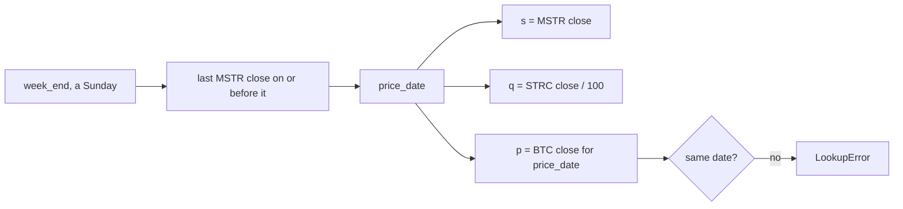

# Prices and Price Dates

> A weekly number needs one price per ticker, all from the same moment. Pick the moment once and apply it to every ticker.

**Type:** Build
**Files:** `dat/prices.py`, `dat/balances.py` (`build()`), `tests/test_prices.py`, `data/prices.csv`, `data/weekly.csv`
**Prerequisites:** 00-03, 01-03
**Time:** ~25 minutes

## Learning Objectives

- Explain why the project uses Yahoo's quote close and not the adjusted close
- Say which CoinGecko point is the close for day D, and why
- Find the price date for any week end and reproduce p, s and q in `data/weekly.csv` from `data/prices.csv`
- Explain why the coin price is looked up at the equity price date, not at the week end

## The Problem

The ruler (lesson 00-03) mixes three prices each week: the coin price p, the common share price s, and the preferred price q (the preferred's close over its $100 notional). Most of Strategy's weeks end on a Sunday, and the stock market is closed on weekends. Bitcoin trades every day.

If p comes from Sunday and s from Friday, m = s / (p·n) compares two different moments, and every week carries a weekend move in the coin price that no action caused. Holidays make it worse: some weeks have no Friday close at all.

A second trap sits in the price feed. Yahoo returns two series: `close`, the price the market printed that day, and `adjclose`, which is back-adjusted for dividends and splits and changes after the fact. The preferred stocks here pay large dividends, so adjusted history would move q for weeks already published (module docstring: "preferred dividends would distort q").

## The Concept

One rule for every ticker (decision R9, `.claude/rules/method.md`):

- **Price date** for a week: the last US trading day on or before `week_end`, found from the firm's own common stock (MSTR, BMNR or SBET).
- Every other ticker, including BTC and ETH, uses a close on that same price date. If one is missing, the run raises.
- **Equity close**: Yahoo's quote close (`close`), settled closes only. Today's bar is kept only after 16:30 exchange time.
- **Coin close for day D**: CoinGecko's point at 00:00 UTC on D+1. That point sits about 4 hours after the US equity close.
- **q for STRC** = STRC close / 100. BMNP's q works the same way on its $100 liquidation preference, except the issue week, which uses the $80 issue price (decision R10; lesson 01-05).



## Build It

### Step 1: Equity closes, not adjusted

From `dat/prices.py`:

```python
def yahoo_rows(j, ticker, now=None):
    """[(date, ticker, close)] keyed by exchange-local trading date; null closes skipped."""
    r = j['chart']['result'][0]
    tz = ZoneInfo(r['meta']['exchangeTimezoneName'])
    now = (now or dt.datetime.now(dt.timezone.utc)).astimezone(tz)
    closes = r['indicators']['quote'][0]['close']
    rows = [(dt.datetime.fromtimestamp(t, tz).date().isoformat(), ticker, c)
            for t, c in zip(r['timestamp'], closes) if c is not None]
    # Today's bar is live until 16:30 exchange-local; keep only settled closes, like gecko_rows.
    return [x for x in rows if x[0] != now.date().isoformat() or now.time() > dt.time(16, 30)]
```

It reads `indicators.quote[0].close` and never touches `adjclose`. Dates come from the exchange's own time zone, so a 09:30 New York timestamp lands on the New York date.

### Step 2: Coin closes at the next midnight UTC

```python
def gecko_rows(j, ticker):
    """[(date, ticker, close)] for each complete UTC day."""
    pts = sorted(j['prices'])
    last = pts[-1][0] // 1000
    out = {}
    # Close for D = last point at or before 00:00 UTC of D+1; D is kept only once that instant has passed.
    for ms, p in pts:
        t = ms // 1000
        end = -(-t // DAY) * DAY  # next 00:00 UTC at or after t
        if end <= last:
            out[dt.datetime.fromtimestamp(end - DAY, dt.timezone.utc).date().isoformat()] = p
    return [(d, ticker, p) for d, p in out.items()]
```

`-(-t // DAY) * DAY` rounds a timestamp up to the next midnight. A point at exactly 00:00 on 05-26 is the close of 05-25. A live intraday point for a day not yet over is dropped, because its midnight hasn't passed.

### Step 3: Pick the price date

`close_on_or_before()` looks back up to 7 days and raises past that. `build()` in `dat/balances.py` uses it twice: once to find the price date from MSTR, then to fetch STRC and BTC at exactly that date:

```python
        price_date, s = close_on_or_before(prices, 'MSTR', week)
        closes = {}
        for t in ('STRC', 'BTC'):
            d, closes[t] = close_on_or_before(prices, t, price_date)
            if d != price_date:
                raise LookupError(f'{t}: no close on {price_date} (MSTR price date for week {week})')
```

### Step 4: Walk one week

The week ending Sunday 2026-06-21 has no equity close on Friday 2026-06-19 in `data/prices.csv`, so its price date falls back to Thursday. From the repo root:

```
.venv/bin/python -c "
import csv
week = '2026-06-21'
rows = [r for r in csv.DictReader(open('data/prices.csv')) if '2026-06-17' <= r['date'] <= week and r['ticker'] in ('MSTR','STRC','BTC')]
for r in rows: print(r['date'], r['ticker'], round(float(r['close']), 2))
w = next(r for r in csv.DictReader(open('data/weekly.csv')) if r['firm']=='MSTR' and r['week_end']==week)
print({k: w[k] for k in ('week_end','price_date','p','s','q')})
"
```

```
2026-06-17 BTC 64444.55
2026-06-17 MSTR 116.56
2026-06-17 STRC 89.0
2026-06-18 BTC 62897.24
2026-06-18 MSTR 112.53
2026-06-18 STRC 88.59
2026-06-19 BTC 63489.81
2026-06-20 BTC 64253.4
2026-06-21 BTC 63255.49
{'week_end': '2026-06-21', 'price_date': '2026-06-18', 'p': '62897.23855524796', 's': '112.52999877929688', 'q': '0.8858999633789062'}
```

BTC has a close for every day, including 06-19 to 06-21. `weekly.csv` uses the 06-18 BTC close ($62,897.24), not the week-end close ($63,255.49), so p and s describe the same day. q = 88.59 / 100 = 0.8859.

Now call the lookup directly:

```
.venv/bin/python -c "
from dat.prices import load, close_on_or_before
P = load('data/prices.csv')
for t in ('MSTR','STRC','BTC'): print(t, close_on_or_before(P, t, '2026-06-21'))
print('BTC on price date', close_on_or_before(P, 'BTC', '2026-06-18'))
try: close_on_or_before(P, 'SBET', '2026-05-01')
except LookupError as e: print('LookupError:', e)
"
```

```
MSTR ('2026-06-18', 112.52999877929688)
STRC ('2026-06-18', 88.58999633789062)
BTC ('2026-06-21', 63255.48525259375)
BTC on price date ('2026-06-18', 62897.23855524796)
LookupError: SBET: no close in [2026-04-24, 2026-05-01]
```

Looking up BTC at the week end would return 06-21. That is why `build()` looks up BTC at the price date and raises if the dates differ.

## Use It

- `data/weekly.csv` stores `price_date` next to p, s, q, m and n for every firm-week, so any row can be checked against `data/prices.csv`.
- The memo's source line says: "Each week uses closes from the last US trading day on or before the week's end."
- The engine's `price` step revalues last week's balances at this week's p, so the weekly coin move is measured between two price dates.
- STRC retirements use the 8-K's disclosed average price where given, else the daily close; `avg_price` records which (decision S9).

## Ship It

PR #4 added `dat/prices.py` and `data/prices.csv` (826 data rows at the time; 921 now, after SBET and later dates). `python -m dat.prices` needs network. The offline check:

```
.venv/bin/python -m pytest -q tests/test_prices.py
```

```
5 passed in 0.02s
```

The five tests cover null closes and quote-not-adjusted, dropping today's bar before 16:30, the midnight rule, the weekend fallback to Friday, and the 7-day limit.

## Decisions

```widget
decisions R9,R10,S9
```

## Exercises

1. **Run it.** Pick the BitMine week ending 2026-06-21 and reproduce its `price_date`, p (ETH), s (BMNR) and q (BMNP / 100) in `data/weekly.csv` from `data/prices.csv`.
2. **Modify it.** In a copy of `data/prices.csv`, delete the 2026-06-18 BTC row and run `build()` from `dat/balances.py` on the MSTR rows. Write down the error it raises and which rule it enforces.
3. **Extend it.** Write a check that, for every row of `data/weekly.csv`, confirms `price_date` is the latest date on or before `week_end` with a close for the firm's own common stock. Run it on all three firms.
