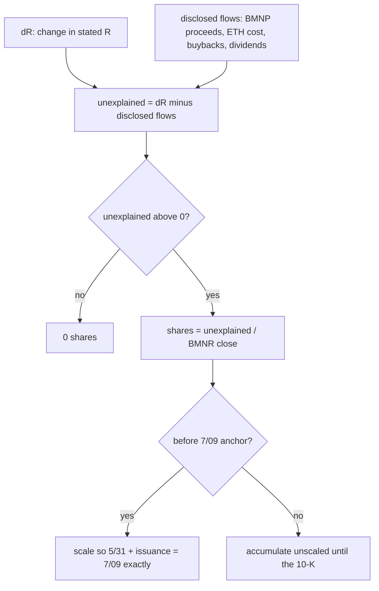

# When the Company Won't Tell You: BitMine's Share Count

> BitMine states its ETH every week and its share count only in quarterly filings. Estimate the gap from the cash it can't otherwise explain, label the estimate, and size its bias.

**Type:** Case study
**Files:** `dat/parse_bmnr.py`, `dat/balances.py` (`bmnr_flows()`, `bmnr_basic()`, `build_bmnr()`, `bmnr_s_bias()`), `data/balances.csv`, `data/staking.csv`, `data/attribution.csv`
**Prerequisites:** 00-03, 01-02, 01-03
**Time:** ~40 minutes

## Learning Objectives

- Map BitMine's weekly release onto C, R, D, F and name what is left out
- Explain why BitMine has no staking rows, using the 13 of 16 weeks and the two site-check results
- Compute one week's estimated issuance from unexplained ΔR and the BMNR close
- Explain the scaling between the 5/31 and 7/09 anchors and the known +0.43% bias
- Say how `KNOWN_DATE_ERRATA` and the strategicethreserve.xyz check keep the ETH series honest

## The Problem

BitMine (ticker BMNR) holds ETH and files a weekly press release as exhibit 99.1 to an 8-K. The release states ETH held, "total cash & marketable securities", ETH bought ("we acquired N ETH"), and share buybacks. It never states how many shares are outstanding. That figure appears only in quarterly and annual filings.

S sits in the denominator of n = N / S. Holding S flat between filings would miss any shares BitMine sold in the meantime, and cash did arrive with no stated source: about $1.08B between 8/16 and 9/20 (build note #7). The project needs a weekly S that traces to something filed, is labeled as an estimate, and has a stated error.

Two terms. **Staking** locks ETH to help run the Ethereum network and earns more ETH as a reward. **Marketable securities** are investments that can be sold quickly, such as listed shares or bonds.

## The Concept

**The mapping** (decision B1, `.claude/rules/method.md` "BitMine mapping"):

| symbol | BitMine | note |
|---|---|---|
| C | ETH held, from the release | exact |
| R | "total cash & marketable securities" | labeled as including securities |
| D | 0 | the 5/31 10-Q states no debt |
| F | BMNP shares × $100 liquidation preference | 3.5M shares issued 2026-06-10 at $80 |
| S | estimated between filings | see below |

BitMine's BTC and equity stakes ("moonshots", about $300M) are left out, because Strategy's definition counts only the coin reserve and USD assets. The page states the excluded amount.

**No staking rows** (decision B2). The first plan booked estimated staking rewards as `carry` rows. Then the data: "ETH acquired" equals the stated holdings change in 13 of 16 weeks, so "acquired" already includes staking. Adding an estimate on top counted it twice, and the ETH check against strategicethreserve.xyz failed at +0.52%. Without the staking rows it reads −0.0006% (build notes #6 and #15). The staking estimate (staked ETH × 7-day yield × 7/365) is still saved per week in `data/staking.csv`, only to size a bias.

**S between filings** (decision B3). Two filed anchors: 579,652,432 shares at 5/31 (10-Q balance sheet) and 603,226,394 at 7/09 (10-Q cover). Each week:



Estimated shares live in `balances.csv` (the `source` column says "S estimated") and in `attribution.csv` as `est_issuance`. They never appear in `actions.csv`, which holds only what a filing states (decision B4).

**The bias** (decision B5). Because "acquired" includes staking, the ETH cost estimate (units × ETH close) prices staked ETH as if it were bought with cash. That makes disclosed outflows too large, unexplained ΔR too large, and estimated S too large: about +0.43% of S by 2026-09-20. The bias is stated, not corrected; the fiscal-year 10-K share count resets it.

## Build It

### Step 1: The weekly estimate

From `bmnr_basic()` in `dat/balances.py`:

```python
    est = {w: max(float(flows[w][2]), 0) / closes[w] if w in flows else 0.0 for w in weeks}
    a1_week = min(w for w in weeks if w >= BMNR_A1[0])
    between = [w for w in weeks if BMNR_A0[0] < w <= a1_week]
    if bb.get(a1_week):
        raise ValueError(f'buyback in week {a1_week}, which holds the {BMNR_A1[0]} anchor: cannot tell if it is before or '
                         'after the cover count; split the week by trade date before rolling')
    scale = (BMNR_A1[1] - BMNR_A0[1] + sum(bb.get(w, 0) for w in between)) / sum(est[w] for w in between)
    out, level = {}, float(BMNR_A0[1])
    for w in weeks:
        if w <= BMNR_A0[0]:
            out[w] = (float(BMNR_A0[1]), 0.0, 'S anchored 10-Q 5/31 balance sheet')
            continue
        add = est[w] * (scale if w <= a1_week else 1)
        level += add - bb.get(w, 0)
        if w == a1_week:
            level = float(BMNR_A1[1]) - sum(bb.get(x, 0) for x in weeks if BMNR_A1[0] < x <= w)
```

`max(..., 0)` is the floor: a week with negative unexplained cash adds no shares. The 7/09 anchor falls inside the week ending 7/12, so that week is set to the anchor exactly.

### Step 2: Run it on the committed data

`build_bmnr()` is a pure function; this prints its per-week lines without writing any file:

```
.venv/bin/python -c "
from dat.balances import read, build_bmnr
from dat.prices import load
st=[r for r in read('data/stated.csv') if r['firm']=='BMNR']; ac=[r for r in read('data/actions.csv') if r['firm']=='BMNR']
b,w,lines=build_bmnr(st,ac,load('data/prices.csv'))
print('\n'.join(lines))
"
```

```
2026-05-31 anchored basic=579,652,432 est_added=0 (first week) S=583,621,427 m=0.9911 q=
2026-06-07 estimated basic=579,782,121 est_added=129,689 (unexplained dR=+1.9M) S=583,751,116 m=1.0290 q=
2026-06-14 estimated basic=587,041,191 est_added=7,259,070 (unexplained dR=+109.2M) S=591,010,186 m=1.0008 q=0.8000
2026-06-21 estimated basic=599,527,596 est_added=12,486,405 (unexplained dR=+188.3M) S=603,496,591 m=0.9787 q=0.8685
2026-06-28 estimated basic=599,527,596 est_added=0 (unexplained dR=-1.8M) S=603,496,591 m=0.8901 q=0.8101
2026-07-05 estimated basic=602,783,167 est_added=3,255,572 (unexplained dR=+43.7M) S=606,752,162 m=0.8774 q=0.8333
2026-07-12 anchored basic=603,226,394 est_added=443,227 (unexplained dR=+6.2M) S=607,195,389 m=0.8670 q=0.8572
2026-07-19 estimated basic=597,930,929 est_added=204,535 (unexplained dR=+3.2M) S=601,899,924 m=0.8851 q=0.8589
2026-07-26 estimated basic=591,830,929 est_added=0 (unexplained dR=-1.5M) S=595,799,924 m=0.8804 q=0.8640
2026-08-02 estimated basic=587,490,348 est_added=159,419 (unexplained dR=+2.8M) S=591,459,343 m=0.9632 q=0.8900
2026-08-09 estimated basic=584,609,653 est_added=119,305 (unexplained dR=+2.2M) S=588,578,648 m=1.0200 q=0.8930
2026-08-16 estimated basic=584,239,663 est_added=1,330,011 (unexplained dR=+24.0M) S=588,208,658 m=0.9974 q=0.9060
2026-08-23 estimated basic=597,916,825 est_added=13,677,162 (unexplained dR=+312.2M) S=602,244,944 m=0.9376 q=0.9326
2026-08-30 estimated basic=613,224,292 est_added=15,307,467 (unexplained dR=+364.3M) S=617,552,411 m=1.0064 q=0.9669
2026-09-07 estimated basic=618,091,559 est_added=4,867,267 (unexplained dR=+121.5M) S=622,419,678 m=1.0497 q=0.9811
2026-09-13 estimated basic=619,090,360 est_added=998,801 (unexplained dR=+25.0M) S=623,418,479 m=1.0281 q=0.9864
2026-09-20 estimated basic=628,233,344 est_added=9,142,984 (unexplained dR=+237.6M) S=632,561,463 m=1.0281 q=0.9791
BMNR: issuance estimates 06-07..07-12 scaled x1.0704 to land on the 7/09 10-Q cover count
```

Two weeks floor at 0 (6/28 and 7/26). Take 8/23: $312.2M of unexplained cash at the 8/21 BMNR close of $22.83 is about 13.68M shares. After 7/12 the estimates are unscaled, and buybacks (7/19 to 8/16) lower the level. The 6/14 week is BMNP's issue week, so q = 0.80, the $80 issue price over $100.

The same week as a waterfall of its attribution parts:

```widget
weekparts BMNR 2026-08-23
```

### Step 3: Size the bias

```
.venv/bin/python -c "from dat.balances import bmnr_s_bias; print(bmnr_s_bias())"
```

```
(0.004264861339738553, '2026-09-20')
```

For each week after the 7/09 anchor week, `bmnr_s_bias()` converts that week's `staking.csv` estimate (about 2,500 ETH a week) to shares at the ETH and BMNR closes, and sums them: 0.43% of S. `tests/test_refresh.py` pins it to two decimals.

### Step 4: Date errata and the outside check

One release says "As of June 28" but reports July 5 holdings. It is fixed by accession number, with the evidence, in `dat/parse_bmnr.py`:

```python
KNOWN_DATE_ERRATA = {
    '0001493152-26-032090': ('2026-06-28', '2026-07-05',
                             'release filed 2026-07-06 says "As of June 28, 2026 at 6:30pm ET" but 0001493152-26-030428 '
                             '(filed 6/29) already reported June 28 at 3:00pm ET; its staked-ETH sentence is dated July 5, 2026'),
}
```

`parse()` raises if the release's date doesn't match the erratum's expected one, so the fix can't apply to the wrong filing.

The outside check compares rolled ETH (first stated figure plus each week's "acquired") with strategicethreserve.xyz. That site has no API and lags about four weeks, so the comparison runs at the site's own `snapshotDate` and fails if the snapshot is more than 42 days before the last week (decision B9). It needs network; PR #5's output:

```
strategicethreserve.xyz BMNR 5847611 (snapshotDate 2026-08-23) vs rolled 5847577 (week 2026-08-23): -0.0006% OK (tolerance 0.1%); snapshot 28 days before last week 2026-09-20 OK (max 42)
```

The 34 ETH gap is the three weeks where "acquired" and the stated change differ: −1 (6/14), +1 (6/21), −34 (8/09).

## Use It

- The page draws `est_issuance` bars hatched as estimated issuance and states the 0.43% bias in its notes.
- The memo footnote puts BitMine's closest week (8/23, m 0.53% above q) next to the bias. `dat/memo.py` fails the build if removing the bias would move any week across the line (decision M5).
- `check.py` check 3 reruns the strategicethreserve.xyz comparison live.

## Ship It

PR #5 shipped the BitMine parser, balances and weekly rows. The offline checks:

```
.venv/bin/python -m pytest -q tests/test_parse_bmnr.py tests/test_balances.py -k "bmnr or staking or site or holdings"
```

```
24 passed, 9 deselected in 0.06s
```

## Decisions

```widget
decisions B1,B2,B3,B4,B5,B6,B7,B9,M5
```

## What Went Wrong

- **#15 and #6.** The staking rows were recommended before anyone looked at the weekly data. A runner's diagnostic showed "acquired" already matched the holdings change, and the decision was reversed with the user. Lesson: check the data before proposing a modeling rule.
- **#9.** The release dated "As of June 28" that reports July 5. Trusting the header would have given two releases for one date.
- **#11.** BitMine's closest week sits 0.53% from the line, near the 0.43% bias. The memo states the margin and the build guards it.

## Exercises

1. **Run it.** Recompute the 8/23 unexplained ΔR from `data/stated.csv` and the 8/23 rows of `data/actions.csv` (R change minus signed flows), then divide by the BMNR close on its price date.
2. **Modify it.** Remove the `max(..., 0)` floor in a copy of `bmnr_basic()` and rerun Step 2. Which weeks change, and by how many shares?
3. **Extend it.** Add a staking `carry` row per week from `data/staking.csv` to a copy of the BitMine actions, re-roll ETH to 2026-08-23 and compare with 5,847,611. Explain the result in terms of the 13 of 16 weeks.
