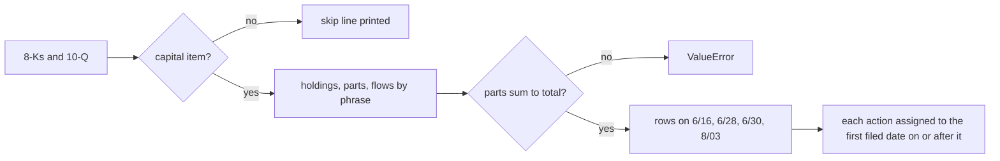

# SharpLink: Measuring a Firm That Files Irregularly

> When a firm states its holdings only now and then, measure it only on those dates, and carry nothing forward between them.

**Type:** Case study
**Files:** `dat/parse_sbet.py`, `dat/balances.py` (`SBET_BASIC`, `SBET_AWARDS_FROM`, `SBET_DILUTIVE`, `sbet_basic()`, `sbet_reserve()`, `build_sbet()`), `tests/test_parse_sbet.py`, `data/actions.csv`, `data/balances.csv`
**Prerequisites:** 00-03, 01-02, 01-03, 01-05
**Time:** ~35 minutes

## Learning Objectives

- Explain why SharpLink has rows only on 2026-06-16, 06-28, 06-30 and 08-03
- Check that native ETH + LsETH + weETH equals a stated total, and trigger the parser's error when it doesn't
- Compute each inferred staking `carry` row from stated holdings and stated purchases
- Build SharpLink's S for 2026-08-03 from basic shares, awards and in-the-money warrants, and name the assumption it rests on
- Say which 8-Ks the parser reads and why the site check's staleness is measured from SharpLink's last filing

## The Problem

SharpLink, Inc. (Nasdaq SBET, CIK 1981535) holds ETH like BitMine, but it files no weekly update. Since 2026-06-01 it has filed three 8-Ks (6/23, 6/30, 8/10) and a Q2 10-Q (8/07); none after 8/10 as of 2026-09-26. Its ETH holdings are stated on four dates, some only in passing.

The weekly model from lessons 01-03 to 01-05 assumes a figure every week. Filling SharpLink's weeks by carrying the last figure forward would put numbers on the page that no filing states. The user chose the other way (decision L1): rows only on the dates a filing states ETH held. The old SharpLink Gaming Ltd. (CIK 1025561) last filed in 2024 and is not used (decision L2).

## The Concept



**C: total ETH, parts checked** (decision L3). SharpLink states "Total ETH Holdings": native ETH plus ETH "as-if redeemed" from two liquid staking tokens, LsETH and weETH. A liquid staking token is a receipt for staked ETH that can itself be traded; "as-if redeemed" converts it back to ETH at the protocol's rate on that date. C is the stated total, labeled. Wherever the filing gives the parts (6/28, 6/30, 8/03), the parser requires native + LsETH + weETH = total.

**Carry: stated change minus stated purchases** (decision L4). Unlike BitMine, SharpLink states purchases separately in ETH and dollars. So the part of each change that purchases don't explain is observable, and it becomes a `carry` row labeled "inferred staking/LST accrual":

| date | stated ETH | change | purchases | carry |
|---|---|---|---|---|
| 2026-06-16 | 875,776 | | | anchor |
| 2026-06-28 | 886,725 | +10,949 | 10,000 | +949 |
| 2026-06-30 | 886,881 | +156 | 0 | +156 |
| 2026-08-03 | 888,938 | +2,057 | 0 | +2,057 |

Rolled ETH equals stated ETH by construction, so the independent checks are the parts sum and strategicethreserve.xyz.

**R, D, F** (decisions L5, L6). Cash is stated only on the 6/30 balance sheet: $56,195K. Other dates roll it by filed cash flows, labeled; operating costs and staking revenue are not itemized, so they land in the residual. D = 0 and F = 0: the 10-Q shows only payables, and no preferred is issued. With no preferred there is no q and no rotation line. The map draws SharpLink at q = 1, where m = q is m = 1.

**S** (decision L7). Basic shares come from the Q2 10-Q (216,983,308 at 6/30 on the balance sheet; 217,223,604 at 8/03 on the cover), rolled by filed issuance and buybacks. Awards and in-the-money warrants are added per Strategy's definition. The 10-Q says the July RSU grants happened "In July 2026", so 7/31 is taken as the grant date. That assumption affects only the 8/03 row.

## Build It

### Step 1: Parse holdings and check the parts

The pattern for the 8-K filed 6/30, from `dat/parse_sbet.py`:

```python
AGG = (rf'As of ({DATE}), the Company{AP}s aggregate ETH Holdings were {N} of which {N} of the total ETH Holdings are '
       rf'native ETH, {N} ETH as-if redeemed from LsETH and {N} ETH as-if redeemed from weETH')
```

and the check in `parse()`:

```python
    for d, ps in parts.items():
        if sum(ps) != hold[d]:
            raise ValueError(f'{where}: {d} parts {ps} sum to {sum(ps)}, stated total {hold[d]}')
```

Feed it the real sentence, then the same sentence with the total off by one:

```
.venv/bin/python -c "
from dat.parse_sbet import parse
F={'accession':'demo'}
agg='<p>As of June 28, 2026, the Company’s aggregate ETH Holdings were 886,725 of which 632,719 of the total ETH Holdings are native ETH, 181,299 ETH as-if redeemed from LsETH and 72,707 ETH as-if redeemed from weETH.</p>'
r=parse(agg,F,'u'); print(r['holdings'], r['parts'])
try: parse(agg.replace('886,725','886,726'),F,'u')
except ValueError as e: print('ValueError:', e)
"
```

```
{'2026-06-28': Decimal('886725')} {'2026-06-28': (Decimal('632719'), Decimal('181299'), Decimal('72707'))}
ValueError: demo (u): 2026-06-28 parts (Decimal('632719'), Decimal('181299'), Decimal('72707')) sum to 886725, stated total 886726
```

### Step 2: Book the inferred carry

From `build()` in `dat/parse_sbet.py`:

```python
        if prev:
            bought = sum(Decimal(a['units']) for a in acts if a['action'] == 'buy_coin' and prev < a['week_end'] <= w)
            accr = hold[w] - hold[prev] - bought
            acts.append(dict(base(w, f, url), action='carry', ticker='STAKE', usd='0', units=fmt(accr), avg_price='',
                             note='inferred staking/LST accrual: stated ETH change less stated purchases'))
```

The committed rows:

```
grep SBET data/actions.csv | cut -d, -f2,5-9
```

```
2026-06-28,buy_coin,ETH,16110400,10000,1611.04
2026-06-28,buyback_common,SBET,10022000,2132773,4.69
2026-06-28,carry,STAKE,0,949,
2026-06-28,issue_common,SBET,73331000,10013351,7.49
2026-06-30,carry,STAKE,0,156,
2026-08-03,carry,STAKE,0,2057,
```

The 6/23 offering and the 6/24 to 6/26 buyback and purchase all land on 6/28, the first filed date on or after them. An action after the last filed date raises, because there is no row to hold it. The issue and buyback dollars come from the 10-Q equity statement (net $73,331K; treasury cost $10,022K), not the 8-K's gross figures (decision L8).

### Step 3: Build R and S

```
.venv/bin/python -c "
from dat.balances import read, sbet_basic, sbet_awards, sbet_options, sbet_reserve
st=[r for r in read('data/stated.csv') if r['firm']=='SBET']; ac=[r for r in read('data/actions.csv') if r['firm']=='SBET']
for w in ('2026-06-16','2026-06-30','2026-08-03'):
    b,_=sbet_basic(ac,w); R,lab=sbet_reserve(st,ac,w)
    print(w, 'basic', round(b), 'awards', sbet_awards(w), 'R', round(R), lab[:40])
print([(n,k) for n,k in sbet_options('2026-08-03') if 6.22 > k])
"
```

```
2026-06-16 basic 209102730 awards 1315859 R 8996400 R rolled from 2026-06-30 balance-sheet c
2026-06-30 basic 216983308 awards 1365124 R 56195000 R = cash, balance sheet
2026-08-03 basic 217223604 awards 3549682 R 56195000 R rolled from 2026-06-30 balance-sheet c
[(80000, 0.0001), (1382007, 6.15)]
```

Working back from 6/30: basic 216,983,308 − 10,013,351 issued + 2,132,773 bought back = 209,102,730 on 6/16. R $56,195,000 − $73,331,000 + $10,022,000 + $16,110,400 = $8,996,400.

For 8/03, with SBET at $6.22: basic 217,223,604 + awards 3,549,682 (1,315,859 RSUs, 49,265 performance RSUs from 6/30, 1,456,375 + 728,183 July grants from 7/31) + warrants in the money 1,462,007 (80,000 pre-funded at $0.0001 and 1,382,007 Consensys at $6.15) = 222,235,293, the `shares_diluted` in `data/balances.csv`.

### Step 4: Filter 8-Ks and measure staleness

```python
CAPITAL_ITEMS = {'1.01', '2.02', '2.03', '3.02', '3.03', '7.01', '8.01'}
```

An 8-K lists the item numbers it reports under. Only these are read; others, such as 5.02 (officers) or 5.07 (shareholder votes), print a skip line and stop nothing (decision L9). 2.02 is included because SharpLink's quarterly results releases state holdings and cash.

The site check compares stated ETH with strategicethreserve.xyz at its `snapshotDate`, with the six-week limit measured against SharpLink's own last filed date, not today (decision L10). Otherwise it would fail every run while SharpLink is silent. From PR #10's live `check.py` run:

```
PASS SharpLink ETH vs strategicethreserve.xyz: strategicethreserve.xyz SBET 888938 (snapshotDate 2026-08-03) vs stated 888938 (filed date 2026-08-03): +0.0000% OK (tolerance 0.1%); snapshot 0 days before SBET's last filed date 2026-08-03 OK (max 42; measured against SharpLink's own last filing, which is 54 days before today)
```

## Use It

- The map shows four SharpLink marks at q = 1, each linking to its filing; the page says its marks are per filed date, not per week.
- The memo title counts SharpLink's dates: m below 1 on 4 of 4 filed dates (m from 0.722 to 0.809 in `data/weekly.csv`).
- `check.py` reports SharpLink residuals per filed date without testing them, since R is not checked (decision A4).
- `dat/refresh.py` watches SharpLink's 10-Q and 10-K filings for a reanchor, from its 2026-06-30 anchor.

## Ship It

PR #10 added SharpLink with MSTR and BMNR rows unchanged in every CSV; the filing-verifier found 44 of 44 SBET figures in the filings. The offline check:

```
.venv/bin/python -m pytest -q tests/test_parse_sbet.py
```

```
19 passed in 0.04s
```

## Decisions

```widget
decisions L1,L2,L3,L4,L5,L6,L7,L8,L9,L10
```

## Exercises

1. **Run it.** Recompute the 8/03 carry from `data/stated.csv` alone, and explain why it has no matching `buy_coin` row.
2. **Modify it.** Move the July grant date from 7/31 to 8/15 in a copy of `SBET_AWARDS_FROM` and recompute S for 8/03. By how many shares does it change, and which rows are untouched?
3. **Break it.** Call `parse_filing()` from `dat/parse_sbet.py` on a made-up 8-K with items `'8.01,9.01'` whose text is "The Company granted Ms. Doe 250,000 restricted stock units." Then change the items to `'5.02,9.01'`. Report what each call does and why.
