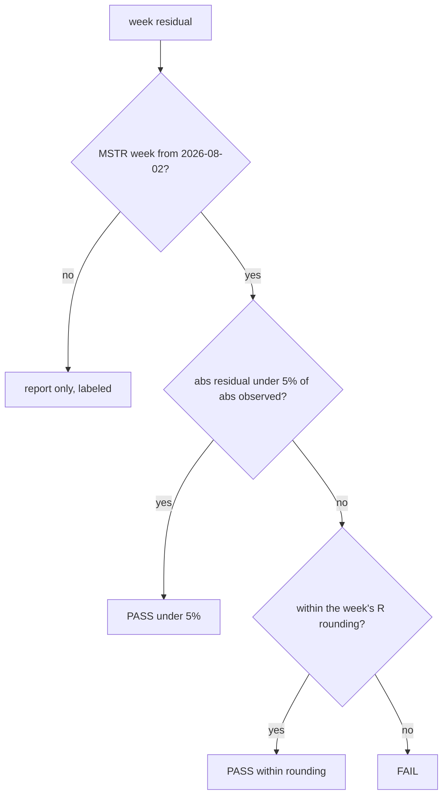

# The Residual as a Bug Detector

> A residual that matches a filed number to the dime is a rule telling you it is wrong.

**Type:** Case study
**Files:** `dat/engine.py` (`residual_test()`), `check.py` (`residuals()`), `.claude/rules/method.md`, `data/attribution.csv`
**Prerequisites:** 02-01
**Time:** ~30 minutes

## Learning Objectives

- State the residual test: pass if |residual| is under 5% of |observed Δn|, or within that week's R rounding tolerance
- Explain which weeks the test applies to and why the others only report their residual
- Retell how the 2026-08-23 residual of exactly $1,570.1M exposed a wrong rule, and check the arithmetic from the 8-K
- Read a `check.py` residual line and say which branch of the test passed

## The Problem

Lesson 02-01 ends every week with a `residual` row: the part of the observed change that no filed action, price move or carry row explains. Some residual is expected. Strategy's 8-Ks round R, the USD assets figure (USD Reserve plus USD Cash), to the last digit they print: $4.0 billion is a figure to the nearest $100M, $5.10 billion to the nearest $10M. The tolerance is half a unit in that last digit for each of the two stated figures, summed ($4.0 billion alone gives ±$50M; the weeks ending 8/02 and 8/09 get ±$55.0M). Before August the 8-Ks also did not itemize every flow into the reserve.

A residual can also mean something is wrong: a missed action, a parser bug, or a rule in `method.md` that doesn't match the filings. The project needs a test that separates those cases, and a habit of reading a large residual as a question about the rules before calling it noise.

## The Concept

The test, from `method.md` "Attribution" item 5, decided 2026-09-25:



- **Scope.** Only Strategy weeks from 2026-08-02, where R is checked against itemized flows. Earlier Strategy weeks, every BitMine week and every SharpLink date report their residual, labeled, without a test.
- **Rounding branch.** A quiet week with rounded disclosures fails a flat 5% with nothing wrong. The week ending 2026-08-30 had a $10.6M residual on a $106.9M week (9.9%), inside the ±$20.0M rounding of the two stated R figures.

Here is the week this lesson is about. The price part dominates; the residual row is small now:

```widget
weekparts MSTR 2026-08-23
```

## Build It

### Step 1: Read the test

`dat/engine.py`:

```python
def residual_test(res, obs, tol_dn):
    """method.md item 5: pass if |res| < 5% of |obs| or |res| <= the week's R rounding tolerance in Δn.
    -> (ok, which): '<5%', 'rounding', or 'FAIL'."""
    if abs(res) < LIMIT * abs(obs):
        return True, '<5%'
    return (True, 'rounding') if abs(res) <= tol_dn else (False, 'FAIL')
```

`LIMIT = 0.05`. The tolerance arrives in dollars from `reserve_checks()` and is divided by S × p to put it in Δn units.

### Step 2: Run the check offline

`check.py` check 4 needs no network:

```
.venv/bin/python -c "
import check
for r in check.residuals('data'): print(r)
"
```

```
{'name': 'residual MSTR 2026-08-02', 'compared': '|residual| $11.7M vs 5% of |observed| $398.3M = $19.9M or R rounding ±$55.0M: <5%', 'ok': True}
{'name': 'residual MSTR 2026-08-09', 'compared': '|residual| $3.2M vs 5% of |observed| $641.8M = $32.1M or R rounding ±$55.0M: <5%', 'ok': True}
{'name': 'residual MSTR 2026-08-16', 'compared': '|residual| $0.9M vs 5% of |observed| $530.7M = $26.5M or R rounding ±$10.0M: <5%', 'ok': True}
{'name': 'residual MSTR 2026-08-23', 'compared': '|residual| $19.9M vs 5% of |observed| $4,140.0M = $207.0M or R rounding ±$10.0M: <5%', 'ok': True}
{'name': 'residual MSTR 2026-08-30', 'compared': '|residual| $10.6M vs 5% of |observed| $106.9M = $5.3M or R rounding ±$20.0M: rounding', 'ok': True}
{'name': 'residual MSTR 2026-09-07', 'compared': '|residual| $6.3M vs 5% of |observed| $363.0M = $18.1M or R rounding ±$20.0M: <5%', 'ok': True}
{'name': 'residual MSTR 2026-09-13', 'compared': '|residual| $0.7M vs 5% of |observed| $455.9M = $22.8M or R rounding ±$20.0M: <5%', 'ok': True}
{'name': 'residual MSTR 2026-09-20', 'compared': '|residual| $2.9M vs 5% of |observed| $780.9M = $39.0M or R rounding ±$20.0M: <5%', 'ok': True}
```

Seven weeks pass on the 5% branch. The 8/30 week passes on the rounding branch.

### Step 3: The rule that was wrong

For 2026-08-23, Strategy's 8-K reported a new balance: USD Cash, $1.59B, next to a USD Reserve of $5.10B. R jumped by that amount. The Step 2 version of `method.md` said this about it (from git history, offline):

```
git show e8ccf12:.claude/rules/method.md | grep -n -A2 "existed before"
```

```
108:  existed before; it was not reported. Step 4 books it as its own row (`disclosure`, labeled
109-  "USD Cash first disclosed"), never as an action or inside the 5% residual test.
110-
```

So the first engine booked a `disclosure` row for the $1.59B. The residual for that week came out at $1,570.1M: 37.9% of the observed $4,140.0M, and far outside both branches of the test. A residual that size, in a week where R is checked against itemized flows, pointed at the rules rather than at rounding.

### Step 4: Read the filing

The 8-K filed 2026-08-24 establishes USD Cash that week. Its ATM footnote (4) says where the money came from:

> $136.4 million in net proceeds from MSTR Stock sales were used to fund repurchases of STRC Stock under the Digital Credit Securities Repurchase Program (defined below), $300.0 million in net proceeds from MSTR Stock sales were used to increase the USD Reserve, and the remaining net proceeds from MSTR Stock sales were used to increase the USD Cash liquidity account.

The week's `issue_common` row in `data/actions.csv` is $2,006.5M. The remainder:

```
python3 -c "print(round(2006.5 - 136.4 - 300.0, 1), f'{1570.1 / 4140.0:.1%}', f'{19.9 / 4140.0:.2%}')"
```

```
1570.1 37.9% 0.48%
```

The USD Cash came from that week's stock sales, which `issue_common` already books into R. The `disclosure` row counted the same dollars a second time. The rule was corrected from the filing, the row was removed, and the residual fell to $19.9M, 0.48% of the week. `method.md` now says: "It is not a disclosure change; no special row. (An earlier version of this file said the cash pre-existed; the filing says otherwise.)"

## Use It

- `check.py` check 4 runs this test on every scheduled run; `snapshot.yml` and `refresh.yml` open an issue when it fails.
- The page's bars show the residual as its own gray category, and the table lists it per week.
- `dat/engine.py` prints the residual for every week, including report-only ones, with its share of |Δn|.

## Ship It

The residual test and its three outcomes are pinned in `tests/test_engine.py` with the 8/30 figures:

```
.venv/bin/python -m pytest -q tests/test_engine.py -k residual_test
```

```
1 passed, 15 deselected in 0.01s
```

## Decisions

```widget
decisions S4,S5,A3,A4
```

## What Went Wrong

- Build note #5: R jumps $1.59B on 8/23. First treated as pre-existing cash; the engine's residual ($1,570.1M, exactly) showed the 8-K funds it from that week's sale proceeds. The 8/23 residual fell from 37.9% to about 0.5%.
- Build note #19: the rule was written without reading the 8-K that established the cash. The fix and the lesson: read the source before writing a rule about it, the same lesson as #15 (a staking rule proposed before looking at the weekly data).

## Exercises

1. Run the Step 2 command and find the week whose residual is closest to its rounding tolerance. How much room does it have?
2. Change `LIMIT` in `dat/engine.py` to `0.02` and rerun `check.residuals('data')`. Which weeks change branch, and do any fail? Revert afterwards.
3. Add a hypothetical `carry` row of +1,590,000,000 usd for MSTR 2026-08-23 to a copy of `data/actions.csv`, run `dat.engine` on the copy, and read the 8/23 line. Explain the residual you get in terms of Step 4.
