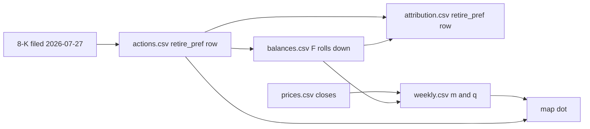

# Trace One Row End to End

> One STRC retirement, followed from the sentence in the 8-K to the dot on the map.

**Type:** Build
**Files:** `data/raw/` (cached 8-K), `dat/parse_mstr.py` (`repurchase()`), `data/actions.csv`, `dat/balances.py` (`pref_notional()`), `data/balances.csv`, `data/attribution.csv`, `data/weekly.csv`, `dat/build_site.py`
**Prerequisites:** 02-01
**Time:** ~35 minutes

## Learning Objectives

- Find the filed figures for one action in its 8-K and match them to its `data/actions.csv` row
- Show how the row's `units` roll the preferred notional F in `data/balances.csv`
- Reproduce the row's `dn_first_order`, `dn_exact` and value to common from `data/attribution.csv`
- Explain why the dot on the map uses a different q from the action's own q

## The Problem

The data rules say a number on the page must trace to a filing. That claim is only worth something if a reader can do the tracing. Each step of the pipeline writes a CSV, and each CSV carries enough to find the row it came from. This lesson walks one row through all of them, so you can do the same for any number on the page.

The row: Strategy's retirement of STRC preferred in the week ending 2026-07-26. STRC is Strategy's Variable Rate Series A Perpetual Stretch Preferred Stock, $100 stated amount per share. To retire preferred is to buy it back and cancel it. When the price paid is below the $100 per share that ranks ahead of common, the difference accrues to common.

## The Concept



Two different q values appear on this path, and both are correct for their use:

- The action's own q is the price actually paid over $100: `avg_price` / 100. The attribution row uses it.
- The week's q is STRC's close on the week's price date over $100. The map dot uses it, next to that week's m.

```widget
map
```

## Build It

### Step 1: The 8-K

The filing is cached in `data/raw/` (gitignored; the parsers fill it on their first run, which needs network). Strip the tags and print the repurchase table:

```
.venv/bin/python -c "
import re, html
t = open('data/raw/000119312526316917/mstr-20260727.htm').read()
t = re.sub(r'\s+', ' ', html.unescape(re.sub(r'<[^>]+>', ' ', t)))
i = t.find('Shares Repurchased'); print(t[i - 190:i + 330])
"
```

```
rogram Updates On July 27, 2026, Strategy announced an update with respect to its share repurchase program of the following securities: During Period July 20, 2026 to July 26, 2026 Security Shares Repurchased Aggregate Purchase Price (in millions) STRF Stock (1) - $ - 10.00% Series A Perpetual Strife Preferred Stock STRC Stock (1) 288,930 $ 25.0 Variable Rate Series A Perpetual Stretch Preferred Stock STRK Stock (1) - $ - 8.00% Series A Perpetual Strike Preferred Stock STRD Stock (1) - $ - 10.00% Series A Perpetual
```

The filed figures: 288,930 STRC shares for $25.0 million.

### Step 2: The actions.csv row

`dat/parse_mstr.py`, `repurchase()`, reads that table by row label and turns shares into notional at the $100 stated amount:

```python
    for t, v in table:
        shares, usd = v['sharesrepurchased'], v['aggregatepurchaseprice(inmillions)'] * SCALE['million']
        if shares == 0 and usd == 0:
            continue
        if t == 'MSTR':
            out.append((end, 'buyback_common', t, usd, shares, usd / shares))
        elif t == 'STRE':
            raise ValueError(f'{where}: STRE retirement is EUR; no USD rate parser for it, add one from this filing')
        else:
            out.append((end, 'retire_pref', t, usd, shares * STATED_AMOUNT, usd / shares))
```

```
grep -E "^MSTR,2026-07-26" data/actions.csv
```

```
MSTR,2026-07-26,2026-07-27,https://www.sec.gov/Archives/edgar/data/1050446/000119312526316917/mstr-20260727.htm,issue_common,MSTR,544500000,5429160,100.291758,
MSTR,2026-07-26,2026-07-27,https://www.sec.gov/Archives/edgar/data/1050446/000119312526316917/mstr-20260727.htm,retire_pref,STRC,25000000,28893000,86.526148,
```

`usd` = 25,000,000, `units` = 288,930 × $100 = 28,893,000 of notional, `avg_price` = 25,000,000 / 288,930 = $86.526148. The `filing_url` is the 8-K from Step 1. The blank `note` means every figure is filed, not estimated.

### Step 3: The preferred notional roll

`dat/balances.py` rolls each preferred's notional from its 6/30 10-Q anchor by the `units` of every `issue_pref` and `retire_pref` row:

```python
def pref_notional(actions, week):
    """{ticker: notional USD at week}, anchored at the 6/30 10-Q, rolled by issue_pref/retire_pref units."""
    return {t: rolled(a, PREF_ANCHOR_DATE, [(r['week_end'], SIGN[r['action']] * float(r['units'])) for r in actions
                                           if r['ticker'] == t and r['action'] in ('issue_pref', 'retire_pref')], week)
            for t, a in PREF_ANCHOR.items()}
```

```
grep -E "^MSTR,2026-07-(19|26)," data/balances.csv | cut -d, -f1-7
```

```
MSTR,2026-07-19,843775,3225000000,6713659000,15466860500,382747145
MSTR,2026-07-26,843775,3750000000,6713659000,15437967500,388176305
```

The columns are firm, date, coins, usd_reserve, debt, pref_notional, shares_diluted. F falls from $15,466,860,500 to $15,437,967,500, a drop of $28,893,000, the row's `units`. No other preferred moved that week. S rose by the 5,429,160 MSTR shares sold.

### Step 4: The attribution row

```
.venv/bin/python -c "
import csv
r = next(r for r in csv.DictReader(open('data/attribution.csv')) if r['firm'] == 'MSTR' and r['week_end'] == '2026-07-26' and r['ticker'] == 'STRC')
w = next(r for r in csv.DictReader(open('data/weekly.csv')) if r['firm'] == 'MSTR' and r['week_end'] == '2026-07-26')
S, p = 388_176_305, float(w['p'])
print(r['action'], r['q'], r['dn_first_order'], r['dn_exact'])
print(f\"value to common: first order \${float(r['dn_first_order']) * S * p:,.0f}   exact \${float(r['dn_exact']) * S * p:,.0f}\")
"
```

```
retire_pref 0.865261 1.5647579930646937e-07 1.5647579659576992e-07
value to common: first order $3,893,000   exact $3,893,000
```

The first-order formula for a retirement is k·(1/q − 1) with k = x/(p·S), so in dollars it is (1/q − 1)·x = 28,893,000 − 25,000,000 = $3,893,000. The exact recompute agrees to the dollar: retiring preferred for cash changes only R and F, not S, so the first-order formula is exact for it. Bitcoin Magazine's figure for this week uses $24.998M, which gives $3.895M; that figure is the unit-test anchor in `tests/test_engine.py`, while the data row keeps the 8-K's rounded $25.0M.

### Step 5: The dot on the map

```
grep "^MSTR,2026-07-26" data/weekly.csv
```

```
MSTR,2026-07-26,2026-07-24,64092.64739795451,91.66999816894531,0.8688500213623047,0.997365,0.001434052526
```

The price date is 2026-07-24, the last US trading day on or before the week end. STRC closed at $86.885, so the week's q = 0.86885, and m = 0.997365. `dat/build_site.py` turns that into the map point:

```
.venv/bin/python -c "
from dat.build_site import build
w = next(w for w in build('data')['weeks'] if w['firm'] == 'MSTR' and w['week_end'] == '2026-07-26')
print(w['m'], w['q'], w['dollars_moved'], w['filing_urls'][0])
" 2>/dev/null
```

```
0.997365 0.8688500213623047 569500000.0 https://www.sec.gov/Archives/edgar/data/1050446/000119312526316917/mstr-20260727.htm
```

That is m, q, dollars moved ($544.5M of MSTR sold plus $25.0M of STRC retired, which sets the dot's area) and the link the dot opens: the same 8-K as Step 1. The dot sits above the m = q line (0.997 > 0.869), on the side where Strategy's rotation adds.

## Use It

- The page's table view lists every week's filing links, so a reader can run this trace from the page back to EDGAR.
- `check.py` check 5 GETs every unique `filing_url` in `data/actions.csv`; urllib raises on a non-2xx status, and any exception (network included) fails the check.
- The filing-verifier agent matched every row of `actions.csv` and `stated.csv` to its filing (build notes, "Checks that hold today").

## Ship It

No new artifact: the trace uses the committed CSVs. The STRC anchor that this row feeds is pinned:

```
.venv/bin/python -m pytest -q tests/test_engine.py -k strc_anchor
```

```
1 passed, 15 deselected in 0.01s
```

## Decisions

```widget
decisions S1,S9,S10,A8,R9
```

## Exercises

1. Trace the STRC retirement for the week ending 2026-09-20 ($174.0M) through the same five steps. Which 8-K does its `filing_url` name, and what is its value to common?
2. Compute the value to common of the 7/26 retirement if Strategy had paid STRC's 7/24 close ($86.885) instead of $86.526148. How much smaller is it?
3. Find a week where STRC's retirement price came from the daily close rather than a disclosed figure, or show that none exists in `data/actions.csv`, by comparing each `avg_price` with the STRC close in `data/prices.csv`.
