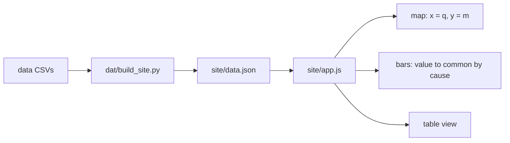

# Drawing the Map and the Bars

> Two charts, drawn by hand in SVG, where every mark opens the filing behind it.

**Type:** Build
**Files:** `dat/build_site.py`, `site/index.html`, `site/app.js`, `site/style.css`, `.github/workflows/pages.yml`
**Prerequisites:** 02-01, 02-03
**Time:** ~40 minutes

## Learning Objectives

- Explain why the map uses one shared axis range for q and m, and compute that range from `data/weekly.csv`
- Describe how a dot's size and link are set, and where `dollars_moved` comes from
- Explain why the bars leave out the coin price and in-the-money flips, and where those values still appear
- List the access features the page ships with: links as dots, one tab stop per bar chart, a table view, a palette checked in both themes
- Run the tests that check the page data against the CSVs

## The Problem

The engine's output is a CSV of 198 rows. A reader needs two answers from it at a glance: where each firm-week sits relative to the break-even line, and what each week's change in n was made of. Two chart failures would mislead. A map whose axes use different ranges bends the m = q line away from 45°, so a dot that sits on the line looks off it. A bar chart that stacks the coin price move buries the actions, because the price part is often 10 to 50 times the week's actions (PR #7).

The page also has to hold up at 375px wide, work from the keyboard, and load nothing from another site.

## The Concept



**The map.** x is q (the preferred's close over its $100 notional), y is m (net mNAV). Both axes share one range, so the diagonal is exactly m = q. Strategy's rotation adds above it (m > q), BitMine's below it (m < q). SharpLink has no preferred, so its marks sit at q = 1, where the line means m = 1. Mark area follows the dollars the firm moved in filed actions that week. Each mark is an `<a>` that opens the week's filing.

```widget
map
```

**The bars.** One chart per firm. Each bar stacks the week's value to common in seven categories: issue common, buy back common, issue preferred, retire preferred, coin trades, carry, residual. BitMine's estimated issuance is hatched inside issue common. The price and flip parts go in the tooltip and the table, not the stack.

## Build It

### Step 1: Group attribution rows into bar categories

`dat/build_site.py` maps each attribution action to a bar and keeps two out of the stack:

```python
CATEGORIES = ['issue_common', 'buyback_common', 'issue_pref', 'retire_pref', 'coins', 'carry', 'residual']
GROUP = {'est_issuance': 'issue_common', 'buy_coin': 'coins', 'sell_coin': 'coins'}  # attribution action -> bar
SEPARATE = ('price', 'itm_flip')  # not stacked: tooltip and table only
```

Each value is `dn_exact × S × p` at the week's S and p. `test_bars_sum_to_observed` checks that the seven categories plus price plus flips equal the observed change within $1 for every week.

### Step 2: One domain for both axes

`site/app.js`, `drawMap()`:

```javascript
  const vals = pts.flatMap(w => [w.m, w.qx]);
  // One domain for both axes so m = q is a true diagonal: [min − 0.05, max + 0.05] rounded out to 0.05.
  const lo = Math.floor((Math.min(...vals) - 0.05) * 20) / 20, hi = Math.ceil((Math.max(...vals) + 0.05) * 20) / 20;
  const X = v => M.l + (v - lo) / (hi - lo) * (W - M.l - M.r), Y = v => H - M.b - (v - lo) / (hi - lo) * (H - M.t - M.b);
  const RMAX = W < 500 ? 14 : 20, dmax = Math.max(...pts.map(w => w.dollars_moved), 1);
  const rad = w => Math.max(4, Math.sqrt(w.dollars_moved / dmax) * RMAX);
```

The same rule in Python, on the committed data:

```
.venv/bin/python -c "
import csv, math
rows = [r for r in csv.DictReader(open('data/weekly.csv')) if r['m'] and (r['q'] or r['firm']=='SBET')]
vals = [v for r in rows for v in (float(r['m']), float(r['q']) if r['q'] else 1.0)]
lo, hi = math.floor((min(vals)-0.05)*20)/20, math.ceil((max(vals)+0.05)*20)/20
print(f'min {min(vals):.4f} max {max(vals):.4f} domain {lo:.2f} to {hi:.2f}')
"
```

```
min 0.7222 max 1.4212 domain 0.65 to 1.50
```

m reaches 1.42, so the shared range runs to 1.50. q stays near 1, so the right side of the plot stays empty. That is the cost of a true diagonal, accepted in decision M7. The radius grows with the square root of dollars moved, so area, not radius, is proportional to dollars.

### Step 3: Every dot is a link

```javascript
    s += '<a href="' + esc(w.filing_urls[0]) + '" target="_blank" rel="noopener" data-tip="' + i + '" aria-label="' + esc(label) + '">'
```

`filing_urls[0]` is the week's primary filing from `data/stated.csv`. The `aria-label` reads the firm, week, m and q, and ends "Opens filing." A dot is a native link, so Tab reaches it and Enter opens it.

### Step 4: One tab stop per bar chart

Each bar chart holds a single `tabindex="0"`. The arrow keys move it:

```javascript
  el.onkeydown = ev => {
    const cols = [...el.querySelectorAll('.col')], i = cols.indexOf(ev.target);
    const step = { ArrowLeft: -1, ArrowRight: 1, Home: -Infinity, End: Infinity }[ev.key];
    if (i < 0 || step == null) return;
    ev.preventDefault();
    const j = Math.max(0, Math.min(cols.length - 1, i + step));
    cols[i].setAttribute('tabindex', '-1');
    cols[j].setAttribute('tabindex', '0');
    ACTIVE[firm] = j;
    cols[j].focus();
  };
```

The tooltip follows focus, and Escape closes it. A `<details>` table under the bars lists every figure, for readers who can't use the charts.

### Step 5: Colors and sources

`site/style.css` defines seven series slots (`--s1` to `--s7`) and a `--neutral` gray for the residual, with a second set for dark mode. PR #7 validated the palette in both modes; the light-mode contrast warning is covered by visible labels and the table view. `site/index.html` loads one stylesheet and one script, both local:

```
grep -nE "<script|<link" site/index.html
```

```
8:<link rel="stylesheet" href="style.css">
103:<script src="app.js"></script>
```

## Use It

- `.github/workflows/pages.yml` runs `python -m dat.build_site` on each push to `main` and deploys `site/` with the CSVs under `data/`.
- `dat/memo.py` draws a static light-theme copy of the same map for the memo, with the same domain rule.
- The table view and the Downloads section give the same numbers as the charts.

## Ship It

The acceptance check for Step 5 was "375px wide, no horizontal scroll; every dot links to its filing", measured in headless Chromium after render (PR #7):

```
{"w":375,"sw":375,"dots":33,"tabstops0":2,"arrowMoves":true}
{"w":1280,"sw":1280,"dots":33,"tabstops0":2,"arrowMoves":true}
```

`w` equal to `sw` means the scroll width equals the viewport: no horizontal scroll. That run had 33 dots, before SharpLink was added in PR #10. The offline tests on the page data:

```
.venv/bin/python -m pytest -q tests/test_build_site.py
```

```
11 passed in 0.11s
```

## Decisions

```widget
decisions M6,M7,M8,M9,M11
```

## What Went Wrong

- Build note #23: a tighter shared domain was requested without checking that m reaches 1.42. The runner kept the full range: a true 45° line matters more than filling the right third.
- Build note #21: a shell redirect left a 0-byte `check.json` that would have broken the first Pages deploy. The workflow now writes to a temp file and moves it, and `build_site.load_check()` treats an empty or invalid file as "not yet run".

## Exercises

1. Run `.venv/bin/python -m dat.build_site` (it fetches the latest BitMine release from EDGAR if `data/raw/` doesn't have it), serve `site/` with `python3 -m http.server -d site`, and open the page at 375px wide in your browser's device mode. Confirm no horizontal scroll.
2. Change `SEPARATE` handling so `price` is stacked into the bars (add it to `CATEGORIES` and the `CAT` table in `app.js`). Look at Strategy's 2026-08-23 bar, where price is +$4,328.6M and issue common is −$215.2M, and describe what you can still read.
3. Give the map separate x and y ranges (x from q only, y from m only) and redraw. Check whether any dot now sits on the other side of the drawn diagonal from where its m and q put it, and explain why the drawn line no longer means m = q.
