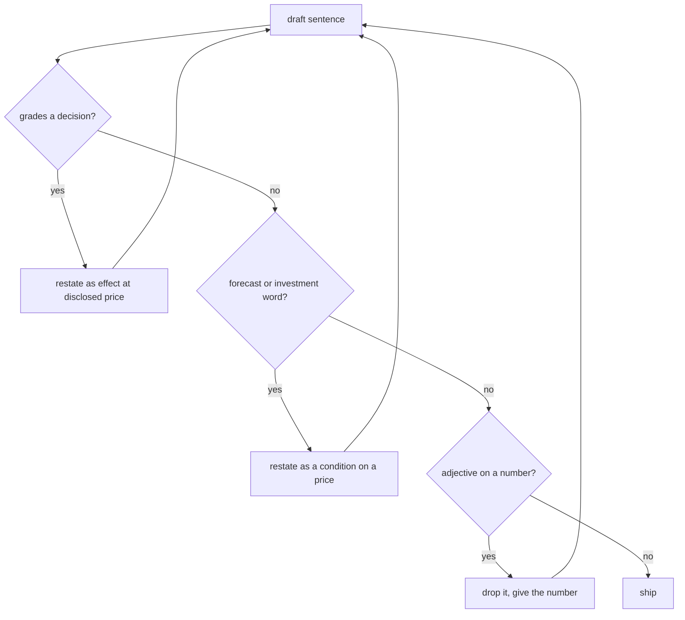

# Facts, Not Verdicts

> The page states what each action did to net coins per share and where break-even sits. It never says whether a decision was good.

**Type:** Concept
**Files:** `.claude/rules/framing.md`, `dat/build_site.py` (`sentence()`), `dat/memo.py` (`title()`, `closest()`), `docs/memo.md`, `tests/test_memo.py`
**Prerequisites:** 03-01
**Time:** ~30 minutes

## Learning Objectives

- Apply the framing rules to a sentence: facts at disclosed prices, no verdicts, no forecasts, no investment words, no adjectives on numbers
- Write a headline in the fixed form and compute its break-even price from m
- Explain why the memo title states counts (18 of 18, 0 of 15, 4 of 4) instead of a claim
- Describe the build guard in `dat/memo.py` that ties the BitMine count to its share-estimate bias

## The Problem

The numbers in this project describe decisions made by public companies. A sentence that grades one of those decisions turns a measurement into an opinion, and a reader who disagrees with the opinion will stop trusting the measurement. `framing.md` calls this "the biggest reputational risk".

There is a second trap. The build started from a hypothesis: that both firms' rotations add net coins per share. The data showed that held for Strategy and not for BitMine. A title written from the hypothesis would state something the data doesn't support. A title written as a reversal (for a made-up firm, "Firm X's rotation fails") would be a verdict. The project needed a form that states the result without either.

## The Concept

The rules in `.claude/rules/framing.md` apply to the site, the memo, the README, PR text and commit messages:

- State each action's per-share effect at disclosed prices and where break-even sits. Never say whether a decision was right, smart or costly.
- No price targets, forecasts or investment language: words such as buy, sell or opportunity, or saying a security trades below its worth.
- Call the metric "Strategy's own net coins per share definition, applied to all three firms."
- Headlines are figures only, in one form.
- Plain words, active voice, no adjectives on numbers, no em dashes.
- Label fallbacks on the page.



A hypothetical example. Draft: "Firm X's buyback was a smart move that created huge value." Fact form: "Firm X's buyback at m = 0.90 added $12.0M of value to common at disclosed prices." The second sentence can be checked against the CSVs; the first can only be argued with.

A condition on a price is the tool for anything that sounds like a forecast. The headline doesn't say where STRC will trade. It says the rotation adds while STRC trades below $100 × m, which anyone can compare with the next close.

## Build It

### Step 1: The headline form

`dat/build_site.py` writes each headline from `data/weekly.csv`. Break-even is $100 × m:

```python
    return (f"At a net mNAV of {h['m']:.3f} (week ending {h['week_end']}), {f['name']}'s {f['pref']} rotation adds "
            f"net {f['unit']} per share while {f['pref']} trades {f['side']} ${h['break_even']:.2f}.")
```

```
.venv/bin/python -c "
from dat.build_site import build
for h in build('data')['headline']: print(h['sentence'])
" 2>/dev/null
```

```
At a net mNAV of 1.217 (week ending 2026-09-20), Strategy's STRC rotation adds net sats per share while STRC trades below $121.71.
At a net mNAV of 1.028 (week ending 2026-09-20), BitMine's BMNP rotation adds net ETH per share while BMNP trades above $102.81.
At a net mNAV of 0.809 (filed date 2026-08-03), SharpLink has no preferred, so no rotation line applies: issuing common adds net ETH per share while m is above 1 and buying back common adds while m is below 1.
```

`framing.md` wrote the form as "At today's net mNAV of m". The page says "week ending" and heads the section "Break-even, latest filed week": the figures come from the last filing, which can be days old. The screenshot review in PR #7 changed "today" to "latest filed week".

### Step 2: The title as counts

`dat/memo.py` counts, per firm, the weeks on the rotation's adding side (m > q for Strategy, m < q for BitMine) and SharpLink's dates with m below 1:

```python
def title(c):
    (a, n, _, _), (b, k, _, _), (x, y, _, _) = c['MSTR'], c['BMNR'], c['SBET']
    return (f"Strategy's STRC rotation sat on its adding side of the break-even line in {a} of {n} filed weeks; "
            f"BitMine's BMNP rotation in {b} of {k}; SharpLink, with no preferred, had m below 1 on {x} of {y} filed dates")
```

```
.venv/bin/python -c "
from dat.balances import read
from dat.memo import counts, title
print(title(counts(read('data/weekly.csv'))))
"
```

```
Strategy's STRC rotation sat on its adding side of the break-even line in 18 of 18 filed weeks; BitMine's BMNP rotation in 0 of 15; SharpLink, with no preferred, had m below 1 on 4 of 4 filed dates
```

"0 of 15" is a count. It states that the hypothesis did not hold for BitMine without grading BitMine.

### Step 3: The guard behind the count

BitMine's closest week, 2026-08-23, sits 0.53% above the line. Its estimated share count carries an upward bias of up to 0.43% of S by 2026-09-20 (staked ETH costed as purchases), and a higher S lowers n, which raises m by the same proportion. If the bias were larger than a week's margin, "0 of 15" could be wrong. `closest()` fails the build in that case:

```python
    asof = max(r['week_end'] for r in rows('BMNR'))
    b = biases[asof]
    bad = [(r['week_end'], f"{biases[r['week_end']]:.4%}") for r in rows('BMNR')
           if not float(r['m']) * (1 - biases[r['week_end']]) > float(r['q'])]
    if bad:
        raise ValueError(f'BitMine m x (1 - that week\'s S bias) is not above q in weeks {bad}: rewrite the footnote')
```

Each week is tested against its own bias, computed from `data/staking.csv`. Feed it a 2% bias to see the guard fire:

```
.venv/bin/python -c "
from dat import memo
from dat.balances import read
rows = read('data/weekly.csv')
try:
    memo.closest(rows, {w: 0.02 for w in memo.week_biases('data', rows)})
except ValueError as e:
    print('ValueError:', e)
"
```

```
ValueError: BitMine m x (1 - that week's S bias) is not above q in weeks [('2026-07-12', '2.0000%'), ('2026-07-26', '2.0000%'), ('2026-08-23', '2.0000%')]: rewrite the footnote
```

A newer BitMine week with no computed bias raises too ("rerun dat.balances"), so the footnote can't go stale.

## Use It

- The page: headlines, map labels ("Strategy's rotation adds here (m > q)"), notes and the method section.
- The memo: title, three paragraphs, the map, and the footnote from `closest()`.
- PR bodies and commit messages: PR #7 reports that every line of page copy was scanned against `framing.md`; PR #8 reports the same for the memo and methodology copy.

## Ship It

`docs/memo.md`, `docs/memo.html` and `docs/memo.pdf`, rebuilt weekly by `refresh.yml`. The guard and the counts are tested offline:

```
.venv/bin/python -m pytest -q tests/test_memo.py
```

```
4 passed in 0.15s
```

## Decisions

```widget
decisions M1,M2,M3,M4,M5
```

## What Went Wrong

Build note #11: the build's starting hypothesis was that both rotations add. The data gave 18 of 18 for Strategy and 0 of 15 for BitMine, with BitMine's closest week 0.53% from the line, near the 0.43% bias. The title became counts, the footnote states the margin, and `dat/memo.py` fails the build if removing the bias would move a week across the line. The bias is computed per week rather than hardcoded; decision M5 notes that a hardcoded value would have failed every run from about 2026-10-13.

## Exercises

1. Write three sentences about a made-up Firm X that grade a decision, forecast a price, or put an adjective on a number. Rewrite each into the fact form with made-up figures for Firm X (an m, a q, a dollar amount), and run each rewrite through the flowchart above.
2. Compute the BMNP break-even for the week ending 2026-08-23 from `data/weekly.csv` and write that week's headline in the fixed form.
3. Change the bias in the Step 3 command to 0.006 and find the smallest value at which the guard fires. Compare it with the 0.53% margin of the 8/23 week.
