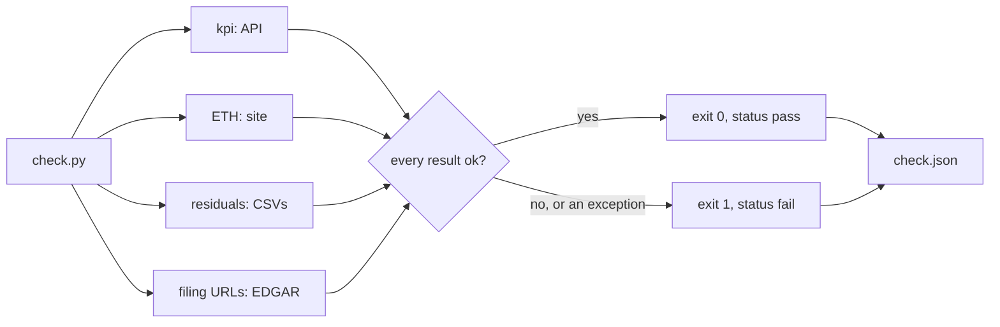

# The Done Check

> One command that exits 0 only when the rebuild still agrees with the world.

**Type:** Build
**Files:** `check.py`, `tests/test_check.py`, `data/check.json` (written by the run, gitignored), `.github/workflows/snapshot.yml`
**Prerequisites:** 00-03, 03-01, 03-02
**Time:** ~35 minutes

## Learning Objectives

- Name the checks in `check.py`, numbered 1 to 5 with 3b and 4b, what each compares and its tolerance
- Explain why a network error counts as a failure and never as a skip
- Apply the residual rule to one week and say whether it passes by "<5%" or by "rounding"
- Read `check.json` and say what the page does with it

## The Problem

The tests in `tests/` run offline against committed CSVs. They prove the code does what it did yesterday. They cannot tell you that Strategy's live figure has moved away from the rebuild, that a third-party ETH tracker disagrees with the parsed holdings, or that a `filing_url` in `actions.csv` no longer resolves.

Step 6 of the build plan set one acceptance check for the whole project: `python check.py` exits 0 against the live API. A done check that passes when it cannot reach the API proves nothing, so the rule is strict: an exception in any check is a failed check.

## The Concept

`check.py` holds six check functions. Each returns one or more results `{name, compared, ok}`. The run passes only if the list is not empty and every result is ok.

| # | function | compares | tolerance |
|---|---|---|---|
| 1-2 | `kpi` | rebuilt netSatsPerShare and amplification vs `api.strategy.com`, at the API's BTC price (`latestPrice`) and Yahoo's MSTR `regularMarketPrice` (intraday during market hours, not a close) | 0.5% (`TOL = 0.005`) |
| 3 | `bmnr_eth` | BitMine rolled ETH vs strategicethreserve.xyz at the site's snapshot week | 0.1%, snapshot at most 42 days before BitMine's last stated week (`SITE_MAX_AGE`), not calendar age |
| 3b | `sbet_eth` | SharpLink stated ETH vs the same site | 0.1%, age measured from SharpLink's last filed date |
| 4 | `residuals` | each MSTR week from 2026-08-02: residual vs 5% of the observed change, or vs the week's R rounding | whichever passes, named in the output |
| 4b | `sbet_residuals` | SharpLink residual per filed date | report only, always ok |
| 5 | `filing_urls` | every unique `filing_url` in `actions.csv` fetches from EDGAR | all must return 200 |

Two finance terms appear here. The **residual** is the part of a week's change in net coins per share that no price move, convert flip, action or carry row explains. **R rounding** is half a unit in the last digit of each stated reserve figure: a filing that says "$5.10 billion" is exact only to ±$5M.



## Build It

### Step 1: Read the runner

The loop in `check.py` turns any exception into a failed result:

```python
CHECKS = [kpi, bmnr_eth, sbet_eth, residuals, sbet_residuals, filing_urls]


def run(data_dir='data', checks=CHECKS):
    """Run every check; an exception (network included) is a failed check, never a skip."""
    out = []
    for fn in checks:
        try:
            rs = fn(data_dir)
        except Exception as e:
            rs = [result(fn.__name__, f'error: {type(e).__name__}: {e}', False)]
        for r in rs:
            print(f"{'PASS' if r['ok'] else 'FAIL'} {r['name']}: {r['compared']}")
        out += rs
    ok = bool(out) and all(r['ok'] for r in out)
    return {'status': 'pass' if ok else 'fail',
            'run_at': dt.datetime.now(dt.timezone.utc).strftime('%Y-%m-%dT%H:%M:%SZ'), 'checks': out}
```

`bool(out)` matters: an empty run is a fail, not a vacuous pass.

### Step 2: Watch a network error fail

Feed `run()` a check that raises the way a dropped connection would:

```python
import check
def offline(data_dir):
    raise OSError('network down')
d = check.run('data', [offline])
print(d['status'], d['checks'])
```

Output:

```
FAIL offline: error: OSError: network down
fail [{'name': 'offline', 'compared': 'error: OSError: network down', 'ok': False}]
```

### Step 3: Run the offline checks

Checks 4 and 4b need only the committed CSVs. Run them alone with `.venv/bin/python -c "import check; print(check.run('data', [check.residuals, check.sbet_residuals])['status'])"`:

```
PASS residual MSTR 2026-08-02: |residual| $11.7M vs 5% of |observed| $398.3M = $19.9M or R rounding ±$55.0M: <5%
PASS residual MSTR 2026-08-09: |residual| $3.2M vs 5% of |observed| $641.8M = $32.1M or R rounding ±$55.0M: <5%
PASS residual MSTR 2026-08-16: |residual| $0.9M vs 5% of |observed| $530.7M = $26.5M or R rounding ±$10.0M: <5%
PASS residual MSTR 2026-08-23: |residual| $19.9M vs 5% of |observed| $4,140.0M = $207.0M or R rounding ±$10.0M: <5%
PASS residual MSTR 2026-08-30: |residual| $10.6M vs 5% of |observed| $106.9M = $5.3M or R rounding ±$20.0M: rounding
PASS residual MSTR 2026-09-07: |residual| $6.3M vs 5% of |observed| $363.0M = $18.1M or R rounding ±$20.0M: <5%
PASS residual MSTR 2026-09-13: |residual| $0.7M vs 5% of |observed| $455.9M = $22.8M or R rounding ±$20.0M: <5%
PASS residual MSTR 2026-09-20: |residual| $2.9M vs 5% of |observed| $780.9M = $39.0M or R rounding ±$20.0M: <5%
PASS residual SBET 2026-06-28 (report only): residual $+0.0M on observed $+13.5M since 2026-06-16; not tested
PASS residual SBET 2026-06-30 (report only): residual $-0.3M on observed $+0.2M since 2026-06-28; not tested
PASS residual SBET 2026-08-03 (report only): residual $-18.8M on observed $-36.4M since 2026-06-30; not tested
pass
```

The 8/30 week shows why the rule has two arms. Its residual, $10.6M, is 9.9% of a $106.9M week, so the flat 5% rule fails it. The filings for 8/23 and 8/30 round R so that the week's rounding is ±$20.0M, and $10.6M sits inside that.

### Step 4: The live run

The full run needs network (Strategy's API, Yahoo, strategicethreserve.xyz, EDGAR). This output is copied from the body of PR #10, a live-network run on 2026-09-26, not run for this lesson:

```
PASS netSatsPerShare vs API: rebuilt 157,921.0127 vs API 157,752.2269: +0.107% (tolerance 0.5%); state from 8-K for week 2026-09-20 (https://www.sec.gov/Archives/edgar/data/1050446/000119312526396093/mstr-20260914.htm; the API may reflect a newer 8-K), BTC $84,061.00 (API latestPrice), MSTR $158.61 (Yahoo)
PASS amplification vs API: rebuilt 1.2477 vs API 1.2476: +0.006% (tolerance 0.5%); state from 8-K for week 2026-09-20 (https://www.sec.gov/Archives/edgar/data/1050446/000119312526396093/mstr-20260914.htm; the API may reflect a newer 8-K), BTC $84,061.00 (API latestPrice), MSTR $158.61 (Yahoo)
PASS BitMine ETH vs strategicethreserve.xyz: strategicethreserve.xyz BMNR 5847611 (snapshotDate 2026-08-23) vs rolled 5847577 (week 2026-08-23): -0.0006% OK (tolerance 0.1%); snapshot 28 days before last week 2026-09-20 OK (max 42)
PASS SharpLink ETH vs strategicethreserve.xyz: strategicethreserve.xyz SBET 888938 (snapshotDate 2026-08-03) vs stated 888938 (filed date 2026-08-03): +0.0000% OK (tolerance 0.1%); snapshot 0 days before SBET's last filed date 2026-08-03 OK (max 42; measured against SharpLink's own last filing, which is 54 days before today)
PASS residual MSTR 2026-08-02: ... (the eight MSTR and three SBET lines from Step 3, identical)
PASS actions.csv filing_url fetch: 40 of 40 unique URLs returned 200
PASS: 16/16 checks pass
```

Sixteen results: 2 KPI, 2 ETH, 8 MSTR residuals, 3 SBET residuals, 1 URL fetch. At v1 (PR #8), before SharpLink, the count was 12/12.

### Step 5: check.json survives a crash

`main()` writes the record in a `finally` block, starting from a fail record, so a crash or a SIGTERM from a step timeout still leaves `status: fail` on disk:

```python
def main(data_dir='data', checks=CHECKS):
    d = {'status': 'fail', 'run_at': dt.datetime.now(dt.timezone.utc).strftime('%Y-%m-%dT%H:%M:%SZ'),
         'checks': [result('check.py', 'did not finish (crash or signal)', False)]}
    try:
        d = run(data_dir, checks)
    finally:  # an unexpected exception or SIGTERM still leaves a fail record
        with open(os.path.join(data_dir, 'check.json'), 'w') as f:
            json.dump(d, f, indent=1)
            f.write('\n')
```

`tests/test_check.py` pins all of this offline: `.venv/bin/python -m pytest -q tests/test_check.py` prints `6 passed`.

## Use It

- `snapshot.yml` runs `check.py` daily after committing the KPI row, then commits `check.json` to the `data` branch.
- `pages.yml` copies that `check.json` into the build; the page's method section shows the done-check status. `build_site.load_check` falls back to "not yet run" when the file is absent, empty or not a JSON object.
- `refresh.yml` runs `check.py` before merging a weekly refresh and pastes its output into the PR body.

## Ship It

`check.py` at the repo root. Offline: `.venv/bin/python -m pytest -q tests/test_check.py`. Live (needs network): `.venv/bin/python check.py`, exit 0.

## Decisions

```widget
decisions A3,A4,A5,A6,B9,L10,O2
```

## What Went Wrong

- **#20:** `check.py` first ran before the daily KPI commit. A slow EDGAR could exceed the job timeout, and GitHub cancels a timed-out job rather than failing it, which skipped both the commit and the alert. The KPI row now commits first and the check has a 5-minute step timeout.
- **#21:** a shell redirect left a 0-byte `check.json` when the `data` branch had none. It now goes to a temp file and is moved into place.
- **#22:** a long live run printed nothing for 10 minutes. `filing_urls` now prints progress every 10 URLs.

## Exercises

1. Run the offline checks from Step 3, then run them again after `import dat.engine; dat.engine.CHECK_FROM['MSTR'] = '2026-07-05'`. Find the week that fails and look up its unexplained reserve change in PR #4's "Labeled, not checked" note (method.md: R is unchecked before 8/02).
2. Write a check function that returns `[]` and pass it alone to `check.run`. Confirm the status is `fail` and find the expression that makes it so.
3. Pick the 9/20 MSTR week from Step 3 and compute by hand whether it would still pass if its residual were $25.0M. Say which arm of the rule decides.
