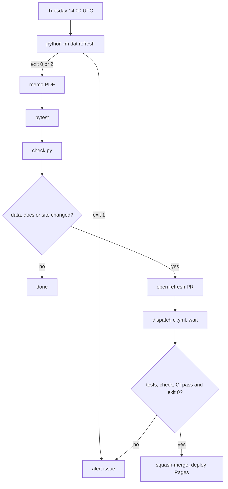

# Running Itself: Cron, Refresh, Reanchor

> Four workflows keep the page current, and each stops for a person when it should.

**Type:** Build
**Files:** `.github/workflows/snapshot.yml`, `.github/workflows/refresh.yml`, `.github/workflows/pages.yml`, `.github/workflows/ci.yml`, `dat/refresh.py`, `dat/edgar.py`, `tests/test_refresh.py`, `tests/test_edgar.py`
**Prerequisites:** 03-03
**Time:** ~40 minutes

## Learning Objectives

- Say what each of the four workflows does, when it runs, and what it writes
- Trace `python -m dat.refresh` through its `STEPS` and give the meaning of exit codes 0, 1 and 2
- List the four conditions `refresh.yml` needs before it squash-merges a refresh PR
- Explain which EDGAR errors are retried and why the others fail at once

## The Problem

Strategy and BitMine file their weekly 8-Ks (current reports) on Mondays. Without automation, the page freezes at the last week someone ran by hand. Strategy's KPI API is worse: it returns only today's value, so a day with no saved snapshot is gone for good.

Automation brings its own failure modes. A job that merges bad data is worse than no job. A job that fails silently looks the same as one that works. And some updates must not run unattended: when a new 10-Q (quarterly report) arrives, the share and preferred anchors every week rolls from need a person to read them.

## The Concept

| workflow | trigger | does |
|---|---|---|
| `snapshot.yml` | daily 21:30 UTC | saves the KPI row to the `data` branch, then runs `check.py` and commits `check.json` |
| `refresh.yml` | Tuesday 14:00 UTC | reruns the pipeline, opens a `refresh/<date>` PR, merges it when everything passes |
| `pages.yml` | push to `main`, a finished `snapshot` run, or by hand | builds the site with the latest `check.json` and deploys it |
| `ci.yml` | pull request, push to `main`, or by hand | `python -m pytest -q tests`; its job `tests` is the required check on `main` |

The `data` branch is append-only. The bot never force-pushes it, because a lost KPI row cannot be fetched again.



When the refresh exits 2, the data still rebuilds and the PR opens, but it stays open and an issue titled "Reanchor needed" asks a person to update the anchors.

## Build It

### Step 1: Commit the KPI row first

In `snapshot.yml`, the order of steps is the design. The row is pushed before anything slow runs:

```yaml
      - name: fetch today's KPI row and raw JSON
        timeout-minutes: 3   # a stalled API fails this step (alert fires) instead of cancelling the job (no alert)
        run: python -m dat.snapshot_kpi _data/data
      - name: commit and push the KPI row first (append-only; never force-push, the API keeps no history)
        id: push_kpi
        working-directory: _data
        run: |
          git config user.name dat-bot
          git config user.email dat-bot@users.noreply.github.com
          git add data
          git commit -m "data: KPI snapshot $(date -u +%F)"
          git push origin data
```

The done check that follows has `timeout-minutes: 5` inside the job's 10. A step timeout fails the step; a job timeout cancels the job, and a cancelled job skips the alert step.

### Step 2: The refresh pipeline

`dat/refresh.py` runs each module's `main()` in a fixed order and stops at the first non-zero return:

```python
def main(data_dir='data'):
    before = last_weeks(data_dir)
    for name in STEPS:
        print(f'== {name}', flush=True)
        code = importlib.import_module(name).main(data_dir)
        if code:
            raise SystemExit(f'{name} exited {code}: refresh stopped')
    after = last_weeks(data_dir)
    print('last week: ' + ', '.join(f'{f} {before[f]} -> {after[f]}' for f in after))
    found = reanchor_filings()
    for firm, f in found:
        print(f"reanchor needed: {f['form']} {f['url']} ({firm}, period {f['period']}, filed {f['filed']})")
    return 2 if found else 0
```

`SystemExit` with a message exits 1. `reanchor_filings()` asks EDGAR for each firm's 10-Q and 10-K filings and keeps those whose report period is after the anchor. Inspect the pieces offline:

```python
from dat import refresh
print(refresh.STEPS)
print(refresh.ANCHORS)
print(refresh.last_weeks('data'))
fs = [{'form': '10-Q', 'period': '2026-06-30'}, {'form': '10-Q', 'period': '2026-09-30'}]
print(refresh.newer(fs, '2026-06-30'))
```

```
['dat.parse_mstr', 'dat.prices', 'dat.parse_bmnr', 'dat.parse_sbet', 'dat.balances', 'dat.engine', 'dat.memo', 'dat.build_site']
[('MSTR', 1050446, '2026-06-30'), ('BMNR', 1829311, '2026-05-31'), ('SBET', 1981535, '2026-06-30')]
{'MSTR': '2026-09-20', 'BMNR': '2026-09-20', 'SBET': '2026-08-03'}
[{'form': '10-Q', 'period': '2026-09-30'}]
```

The order matters: `dat.prices` runs before the BitMine and SharpLink parsers because they need ETH and SBET closes, and every parser runs before `dat.balances`. `tests/test_refresh.py` pins it.

### Step 3: The merge gate

`refresh.yml` runs pytest and `check.py` with `continue-on-error`, so both results are known before it decides. It merges only when all four signals agree:

```yaml
      - name: squash-merge (only when pytest, check.py and CI passed and no reanchor is needed), then deploy Pages
        id: merge
        if: >-
          steps.ci.outcome == 'success' && steps.tests.outcome == 'success' &&
          steps.check.outcome == 'success' && steps.refresh.outputs.code == '0'
```

Two GitHub details shape the rest. A PR opened with `GITHUB_TOKEN` triggers no workflows, so the job runs `gh workflow run ci.yml --ref "$branch"` and waits for the run whose head SHA matches its own commit. A push by `GITHUB_TOKEN` does not trigger `pages.yml` either, so the merge step dispatches it. Opening and merging PRs from Actions needs the repo setting "Allow GitHub Actions to create and approve pull requests", turned on 2026-09-26.

### Step 4: One issue per failure streak

Both scheduled workflows end with the same alert pattern. It comments on an open issue with the same title if there is one, else opens a new issue:

```yaml
          n=$(gh issue list --state open --search "\"$title\" in:title" --json number -q '.[0].number')
          if [ -n "$n" ]; then gh issue comment "$n" --body "Failed again: $url $detail"
          else gh issue create --title "$title" --body "Run: $url $detail"; fi
```

The refresh titles the issue "Reanchor needed" only when the exit code is 2 and nothing else failed; otherwise "Weekly refresh failed".

### Step 5: Retry EDGAR 429 and 503

The first refresh run, started by hand with `workflow_dispatch` rather than by the schedule, failed on one `HTTP Error 503: Service Unavailable` from EDGAR (PR #12). `SECClient.get` in `dat/edgar.py` now retries only those two codes:

```python
    RETRY = (429, 503)  # EDGAR sheds load with these; retried with backoff, then fail loudly
    BACKOFF = (5, 15, 45)
```

```python
            except urllib.error.HTTPError as exc:
                if exc.code not in self.RETRY or wait is None:
                    raise RuntimeError(f'SEC access failed; no synthetic substitute: {url}: {exc}') from exc
                print(f'EDGAR {exc.code} on {url}; retry in {wait}s', flush=True)
                time.sleep(wait)
```

`.venv/bin/python -m pytest -v tests/test_edgar.py`:

```
tests/test_edgar.py::test_retries_503_then_succeeds PASSED               [ 33%]
tests/test_edgar.py::test_gives_up_after_backoff PASSED                  [ 66%]
tests/test_edgar.py::test_404_fails_at_once PASSED                       [100%]
============================== 3 passed in 0.03s ===============================
```

## Use It

- The `data` branch holds `kpi_snapshots.csv`, the raw JSON per day in `data/kpi/`, and `check.json`.
- Refresh PRs carry the `last week:` line, any `reanchor needed:` lines and the full `check.py` output in their body.
- The page's done-check status comes from the latest `check.json` on `data`.

## Ship It

Four workflow files and `dat/refresh.py`. Offline check: `.venv/bin/python -m pytest -q tests/test_refresh.py tests/test_edgar.py`. The live path (needs network and GitHub): run the `refresh` workflow by hand from the Actions tab.

## Decisions

```widget
decisions P6,O1,O2,O3,O4,O5,O6,O7,O8
```

## What Went Wrong

- **#20:** the done check first ran before the KPI commit, so a slow EDGAR could get the whole job cancelled with no row and no alert.
- **#21:** `git show ... > data/check.json || true` left a 0-byte file. `pages.yml` now writes to `/tmp/check.json` and moves it.
- The memo's BitMine bias was hardcoded before PR #9. Run weekly, it would have failed every build from about 2026-10-13, so it is now computed from `data/staking.csv`.

## Exercises

1. Run the Step 2 snippet, then add a fake filing with `period` `'2026-05-31'` to `fs` and pass BitMine's anchor date. Predict the output before you run it.
2. Change `BACKOFF` to `(1, 2)` in a scratch copy and rerun `tests/test_edgar.py`. Say which test fails and what it counts.
3. Write down the steps `refresh.yml` runs when `dat.refresh` exits 1. Which steps are skipped, and which issue title does the alert use?
