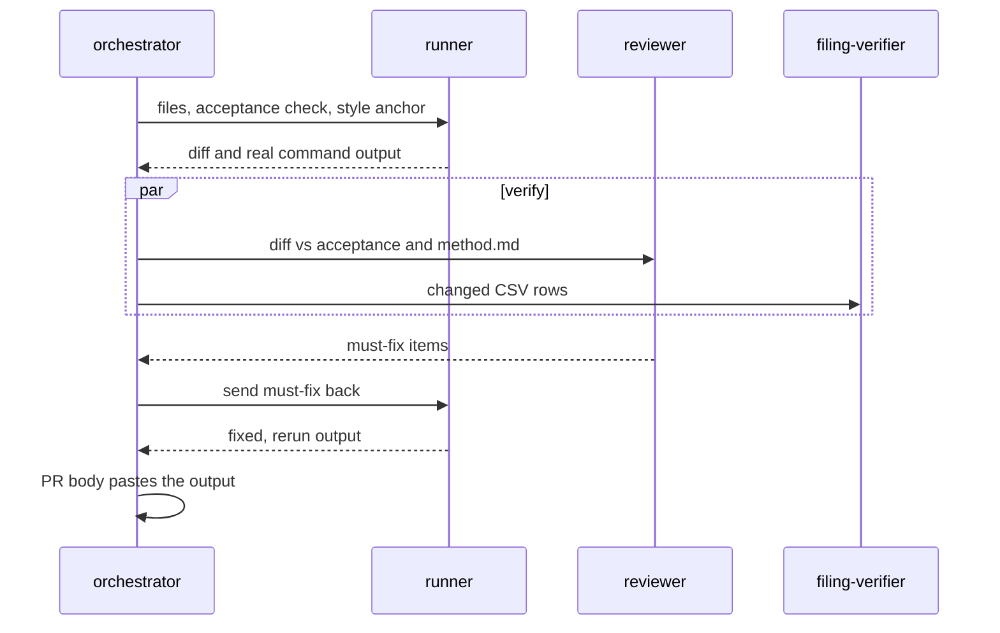

# Building With Agents

> A written loop, three rule files and a checker that never writes code.

**Type:** Concept
**Files:** `CLAUDE.md`, `.claude/skills/build-step/SKILL.md`, `.claude/agents/filing-verifier.md`, `.claude/rules/method.md`, `.claude/rules/data.md`, `.claude/rules/framing.md`
**Prerequisites:** None
**Time:** ~25 minutes

## Learning Objectives

- Name the four roles (orchestrator, runner, reviewer, filing-verifier) and what each never does
- Write a dispatch that meets the delegation contract: exact files, an acceptance check, a style anchor
- Walk the six steps of the `build-step` skill for one build step
- Give one defect from a PR body that the reviewer caught and the runner missed

## The Problem

The project was built with Claude Code over two days, 2026-09-25 and 2026-09-26, in 11 pull requests after one scaffold commit. In this build, checks by a separate agent caught silent-skip paths, an untraceable share count and two workflow failure modes that the implementing agent missed (decisions.md P8). Three things go wrong without structure:

- Decisions drift between steps, because the next agent never saw the conversation that made them.
- A vague request gets vague code: no named files, no way to say "done".
- Numbers in a PR are retyped from memory instead of copied from the command that printed them.

## The Concept

Work is split among four roles. `filing-verifier` lives in this repo; `runner` and `reviewer` are general agents defined outside it.

| role | does | never |
|---|---|---|
| orchestrator | reads the spec and rules, asks the user when a choice changes the output, dispatches the others, writes the PR | writes the step's code |
| `runner` | implements one step against a named acceptance check | decides open questions |
| `reviewer` | checks a finished change adversarially: reruns tests, recomputes numbers by hand, looks for silent failures | edits |
| `filing-verifier` | opens each filing at a row's `filing_url` and confirms the row's numbers appear in it | edits |



**The delegation contract.** Every dispatch to `runner` or `reviewer` names three things: the exact files to create or edit, the acceptance check as a command or an observable outcome, and a style anchor (an existing file or function to match). The contract exists because the agents share no memory of earlier turns.

**Rule files carry decisions.** `CLAUDE.md` holds the stack, the build plan and one acceptance check per step. `.claude/rules/method.md` is the math source of truth, `data.md` covers sources and provenance, `framing.md` covers page language. When a step settled a question, the decision went into the rule file with its date, in the same PR.

```widget
timeline
```

## Build It

### Step 1: Read the build plan

Each step has a branch and one acceptance check. From `CLAUDE.md`:

```
| 1 | step-1-parse-mstr | Strategy 8-Ks → actions.csv | each week's rolled BTC equals the 8-K's stated holdings exactly |
```

The check is written before the code, and it is concrete enough to fail.

### Step 2: The dispatch

Step 3 of `.claude/skills/build-step/SKILL.md` is the contract in practice:

```
3. **Delegate.** Dispatch `runner` with:
   - exact files to create or edit (from the spec's repo layout),
   - the acceptance check as a command or observable outcome, copied from the build plan,
   - style anchor: existing `dat/` modules; for patterns not yet here, `~/projects/spine`
     (`spine/*.py` for modules, `site/` for the page),
   - constraints: stdlib + numpy only, `python -m dat.<module>` entry, parse by label and fail
     loudly, every row keeps `filing_url`.
```

### Step 3: Verify in parallel

The skill's step 4 sends the diff to `reviewer` and the changed CSV rows to `filing-verifier` at the same time. The verifier's instructions in `.claude/agents/filing-verifier.md` fix how it reads a filing:

```
For each row:
1. Load the filing from `data/raw/` if cached; otherwise fetch `filing_url` with
   `curl -s -A "dat-accretion rbhavanzim@gmail.com"`, one request at a time, at least 0.6s apart.
2. Find the row's figures in the filing's table (usd, units, avg_price, or the stated aggregate
   holdings / USD Reserve). Match by row label and ticker, not position.
3. Record MATCH, MISMATCH (filing value vs CSV value), or NOT FOUND.
```

Its tools are Read, Grep, Glob and Bash, and its instructions say "You never edit."

### Step 4: One PR per step, with real output

`main` is protected by the `tests` check, and every change after the scaffold landed through a squash-merged PR. List them:

```
$ git log --oneline main
5299461 Retry EDGAR 429 and 503 with backoff before failing (#12)
d1a01cc Step 7: SharpLink as a third firm, on its filed holdings dates (#10)
e0172de Weekly refresh: rebuild data, memo and site from new filings (#9)
a73ce7a Add the live done check, the one-page memo and the methodology note (#8)
e2990b9 Add the public page: break-even map, attribution bars, method, Pages deploy (#7)
4402dce Add the attribution engine: five formulas, exact recompute, weekly residual (#6)
f4c4964 Step 3: BitMine actions, balances, weekly m and q (#5)
e8ccf12 Step 2: Strategy balances, daily prices, weekly m and q (#4)
1e4d4aa Parse Strategy weekly 8-Ks into actions.csv and stated.csv (#3)
0c3f1b9 Step 0: Strategy net definition rebuilt within 0.11% of the KPI API; BMNP terms (#2)
d35cd71 Step 0: daily Strategy KPI snapshot and CI (#1)
34c9bd7 Scaffold dat-accretion: layout, method and data rules, build-step skill
```

Each PR body pastes the acceptance check's real output. PR #3's, for example:

```
$ .venv/bin/python -m dat.parse_mstr
8-Ks read 24, skipped 7, parsed 17; actions.csv 36 rows, stated.csv 18 rows
...
$ .venv/bin/python -m pytest -q
19 passed
```

### Step 5: What the reviewer caught

Three PR bodies record defects the implementing agent missed:

- **#3, silent skip.** "the first pass failed on a silent-skip hole and a STRE retirement path. Both are fixed and tested, and the CSVs came out byte-identical after the fix."
- **#5, three rounds.** Round 1 fixed estimate labels, fail-loud vocabulary and a dead import. Round 2 replaced reserve regex lists with a consumption guard. Round 3 added coverage, hedge and holdings-change guards.
- **#8, cancel vs fail.** "check.py ran before the KPI commit, so a slow EDGAR could time out the job; GitHub then *cancels*, skipping both the commit and the alert." Round 2 passed after the KPI row moved first.

## Use It

- A weekly refresh PR follows the same rule as a build step: its body is the real `check.py` output.
- `docs/build-notes.md` credits each catch ("Caught by: Reviewer", "Runner", "Watchdog").
- `docs/decisions.md` P8 and P9 record this split and the rule-file habit as decisions.

## Ship It

The artifacts are the five tracked files under `.claude/` (`agents/filing-verifier.md`, `rules/data.md`, `rules/framing.md`, `rules/method.md`, `skills/build-step/SKILL.md`) and the build plan in `CLAUDE.md`. Check that each merged PR names its acceptance output: `gh pr view 4 --json body -q .body` (needs network).

## Decisions

```widget
decisions P2,P4,P5,P8,P9
```

## What Went Wrong

- **#13:** Step 0 percentages were first written from a different API snapshot than the test pinned. The runner caught it; docs now cite the test's own output.
- **#14:** a research agent's class A share count did not trace to a filing. The reviewer replaced it with the traceable count.
- **#22:** a runner stalled 10 minutes on a live-network run with no output. It resumed with a 300-second cap and progress lines.

## Exercises

1. Pick build step 2 from `CLAUDE.md` and write the runner dispatch for it: the files, the acceptance check copied from the plan, a style anchor from `dat/`, and the constraints from SKILL.md step 3.
2. Read `gh pr view 6 --json body -q .body` (needs network) and list what the reviewer recomputed independently. Say which of those a runner rerunning its own tests could not have caught.
3. `filing-verifier` checks rows against filings. Write a two-line spec for a fifth role that checks page copy against `framing.md`, naming its tools and what it never does.
