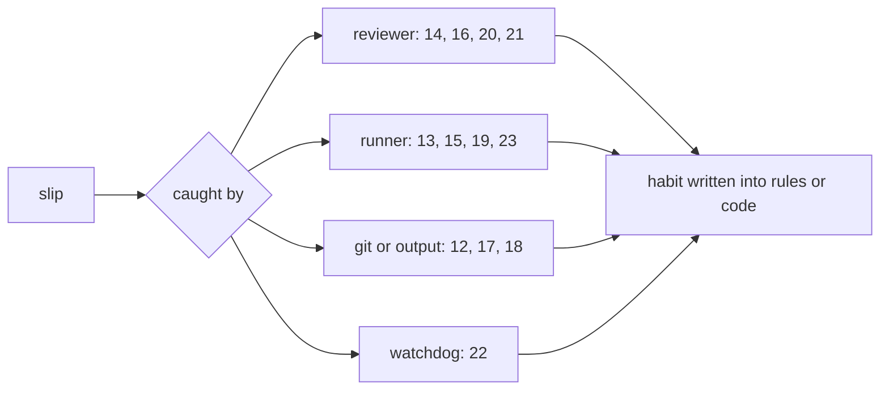

# What Went Wrong, and What It Taught

> Twelve process slips from the build, grouped into seven habits.

**Type:** Case study
**Files:** `docs/build-notes.md`, `dat/parse_bmnr.py`, `dat/parse_mstr.py`, `dat/balances.py`, `tests/test_balances.py`, `.github/workflows/pages.yml`, `data/attribution.csv`
**Prerequisites:** 04-01
**Time:** ~30 minutes

## Learning Objectives

- Retell each of build notes #12 to #23 in one line and name who or what caught it
- Group them into habits: check the data first, read the source first, structural guards, traceable over close, numbers from pinned output, line endings, workflow failure modes
- Rerun the evidence for #15, #19 and #13 from committed files
- Spot the same failure pattern in a change you are about to make

## The Problem

`docs/build-notes.md` has two tables. Items #1 to #11 are places where the spec met the filings. Items #12 to #23 are places where the build's own process slipped. A reviewer, a runner, a watchdog, git or an empty output caught each one. This lesson reads them as a set, because most repeat one of a few patterns.

## The Concept



| habit | notes | the slip |
|---|---|---|
| Check the data before proposing a rule | #15, #6, #23 | staking estimate recommended before looking at weekly data; a tighter map domain asked for without checking that m reaches 1.42 |
| Read the source before writing a rule | #19, #5 | method.md said the 8/23 USD Cash "existed before" without reading the 8-K |
| Structural guards over word lists | #16, #18 | parsers skipped trades silently; a sentence split broke on "$5.04" |
| Traceable over close | #14 | a class A count that matched the API better but did not trace to a filing |
| Numbers from pinned output | #13 | Step 0 percentages taken from a different API snapshot than the test pinned |
| Line endings and staging | #17, #12 | CRLF from `csv`; `git add -A` committed `egg-info` |
| Workflow failure modes | #20, #21, #22 | cancel vs fail; a 0-byte `check.json`; a silent 10-minute run |

## Build It

### Step 1: Check the data first (#15, #6)

The spec booked BitMine staking as `carry` rows, and that was the first recommendation too. A runner's diagnostic then showed BitMine's "ETH acquired" already equals the stated change in holdings most weeks. Reproduce it from the committed CSVs:

```python
import csv
from decimal import Decimal as D
st = sorted((r for r in csv.DictReader(open('data/stated.csv')) if r['firm']=='BMNR'), key=lambda r: r['week_end'])
acq = {}
for a in csv.DictReader(open('data/actions.csv')):
    if a['firm']=='BMNR' and a['action']=='buy_coin': acq[a['week_end']] = acq.get(a['week_end'],0)+D(a['units'])
eq = [c['week_end'] for p,c in zip(st,st[1:]) if D(c['coins'])-D(p['coins']) == acq.get(c['week_end'],0)]
print(f'{len(eq)} of {len(st)-1} weeks: stated change = ETH acquired')
```

```
13 of 16 weeks: stated change = ETH acquired
```

A separate staking row counted staking twice: the ETH site check read +0.52%, a fail. Without it: −0.0006%. The decision was reversed with the user (decisions.md B2).

### Step 2: Read the source first (#19, #5)

method.md once said the $1.59B of USD Cash first reported for 2026-08-23 had existed before, and a `disclosure` row added it. The engine's residual for that week came out at $1,570.1M, which is exactly 2,006.5 − 136.4 − 300.0: the week's MSTR sale proceeds, minus $136.4M of STRC retired, minus $300.0M for the USD Reserve (method.md). The 8-K filed 2026-08-24 funds USD Cash from "the remaining net proceeds from MSTR Stock sales", already booked by `issue_common`. The row was removed and the week's residual fell from 37.9% to about 0.5%. Today's row:

```
$ grep "MSTR,2026-08-23,residual" data/attribution.csv
MSTR,2026-08-23,residual,,,,,,6.057140697797447e-07,,
```

### Step 3: Structural guards (#16, #18)

Three review rounds on PR #5 each found a phrasing the parsers' word lists missed. The fix was to raise on structure instead. One of the guards, in `dat/parse_bmnr.py`:

```python
    prev_coins = None
    for f, url, r in releases:
        week = r['week_end']
        if prev_coins is not None and r['coins'] != prev_coins and r['acquired'] is None:
            raise ValueError(f"{f.get('accession', '')} ({url}): ETH holdings changed {prev_coins} -> {r['coins']} "
                             f"but no 'we acquired N ETH' sentence; unknown source of the change")
        prev_coins = r['coins']
```

It does not need to know every way a release can phrase a purchase. It needs only the fact that holdings moved and nothing explained it. `reserve_guard` in `dat/parse_mstr.py` applies the same idea: every `$` amount in a USD Reserve sentence must be consumed by a known phrase. #18 is the small version: a split on every period cut "$5.04" and "U.S.", and `sentences()` now handles both, with a test.

### Step 4: Traceable over close (#14)

A research agent's class A count matched the API better, but one week was counted twice. The reviewer replaced it with the count from the 10-Q cover, in `dat/balances.py`:

```python
# Class A as of 2026-07-24 (10-Q cover); the 7/20-7/26 week's ATM sales are taken as included.
CLASS_A, CLASS_A_WEEK = 364_585_501, '2026-07-26'
```

The rebuild error rose from 0.02% to 0.11%, still inside the 0.5% gate.

### Step 5: Numbers from pinned output (#13)

The Step 0 percentages were first written from a different API snapshot than the test pins. The doc now cites the pinned snapshot, and numbers in docs come from the test's own output. Print it from `tests/test_balances.py`:

```python
import sys; sys.path.insert(0, 'tests')
from test_balances import run, API
x = run()
for k in API: print(f'{k:20} rebuilt {x[k]:.4f}  API {API[k]}  err {x[k]/API[k]-1:+.3%}')
```

```
net_sats_per_share   rebuilt 157899.6146  API 157730.9538  err +0.107%
net_reserve_usd      rebuilt 56959456000.0000  API 56961379020  err -0.003%
amplification        rebuilt 1.2478  API 1.2478  err +0.004%
mnav                 rebuilt 1.1980  API 1.1994  err -0.114%
```

These match the table in method.md and PR #2.

### Step 6: Line endings and staging (#17, #12)

Python's `csv` writer ends rows with CRLF by default; git flagged it. Every writer now passes `lineterminator='\n'`, as `merge_write` in `dat/parse_bmnr.py` does:

```python
    with open(path, 'w', newline='') as f:
        w = csv.DictWriter(f, fieldnames=fields, lineterminator='\n')
```

#12: `git add -A` staged `egg-info` build output. It was removed and gitignored before merge. Read `git status` before staging everything.

### Step 7: Workflow failure modes (#20, #21, #22)

GitHub cancels a job that hits its timeout; it does not fail it, and a cancelled job skips the alert. `snapshot.yml` now commits the KPI row first and gives the check a 5-minute step timeout inside the 10-minute job (#20). A shell redirect left a 0-byte `check.json`; `pages.yml` now writes to a temp file first (#21):

```yaml
        run: git fetch origin data && git show FETCH_HEAD:data/check.json > /tmp/check.json && mv /tmp/check.json data/check.json || true
```

#22: a runner ran a live network command for 10 minutes with no output. It resumed with a 300-second cap, and `check.py` prints progress every 10 URLs.

## Use It

- `.claude/rules/data.md` records the staking reversal; method.md records the USD Cash correction with "An earlier version of this file said the cash pre-existed; the filing says otherwise."
- The parsers' raise paths are the guards from #16; the tests in `tests/test_parse_mstr.py` and `tests/test_parse_bmnr.py` exercise them.
- `docs/decisions.md` cites these notes by number (S5, S11, R7, A6, B2, O1, O2, O9).

## Ship It

`docs/build-notes.md` is the artifact. Check that the evidence still holds: `.venv/bin/python -m pytest -q tests/test_balances.py tests/test_parse_bmnr.py`.

## Decisions

```widget
decisions B2,S5,S11,R7,A6,O1,O2,O9
```

## What Went Wrong

This whole lesson is build notes #12 to #23. The one not retold above is #23: a tighter shared map domain was asked for without checking that m reaches 1.42. The runner kept the full 0.65 to 1.50 domain, since a true 45° line matters more than filling the right third.

## Exercises

1. Extend the Step 1 script to print the three weeks where the stated change and "ETH acquired" differ, and the size of each gap.
2. Read `data/actions.csv` with `csv.DictReader`, write its rows to a file in a scratch directory with a `csv.DictWriter` that omits `lineterminator`, and run `file` on both. Say what git would report if that file replaced the committed one.
3. Write a new structural guard for SharpLink in the style of Step 3: raise when a filed date's stated ETH differs from the previous date's and there is neither a purchase nor a carry row. Say which existing rule in method.md makes this guard redundant today.
