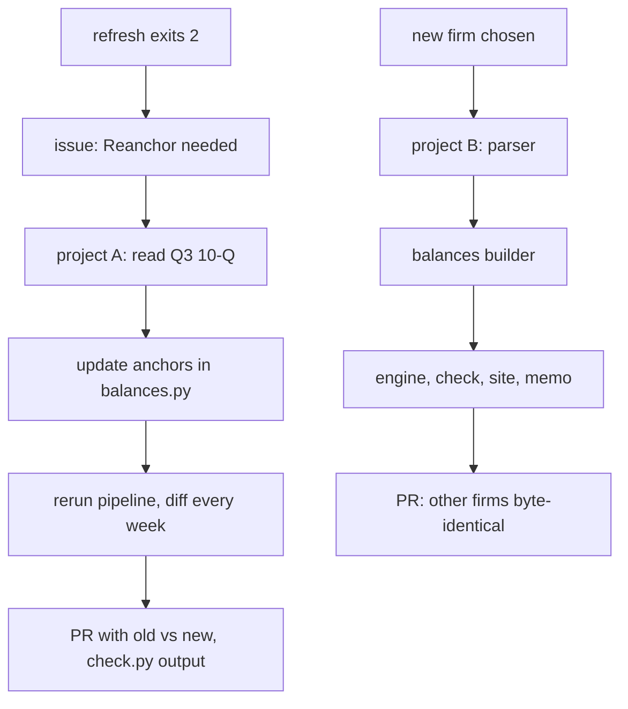

# Capstone: Reanchor or Add a Firm

> Two changes the project will need, planned the way the build planned every step.

**Type:** Build
**Files:** `dat/balances.py`, `dat/refresh.py`, `dat/engine.py`, `dat/prices.py`, `dat/build_site.py`, `dat/memo.py`, `check.py`, `site/app.js`, `dat/parse_sbet.py` (pattern), `tests/test_balances.py`, `tests/test_refresh.py`, `.claude/rules/method.md`, `.claude/rules/data.md`
**Prerequisites:** 00-03, 03-03, 03-04, 04-01
**Time:** ~3 hours per project

## Learning Objectives

- Plan a reanchor of Strategy on its Q3 10-Q: name each constant that changes, what to verify, and what the PR shows
- Plan a fourth firm on the SharpLink pattern: list the files, the order of work and the acceptance checks
- Write a runner dispatch for either project that meets the delegation contract
- Say which existing rows must stay byte-identical and how to prove it

## The Problem

Two things will happen whether or not anyone plans for them.

First, Strategy files a 10-Q (quarterly report) for the quarter ending 2026-09-30. `dat.refresh` then exits 2, the weekly refresh PR stays open, and an issue titled "Reanchor needed" waits for a person. The anchors that every week's preferred notional and share count roll from still point at the Q2 10-Q.

Second, a fourth firm with a coin reserve may be worth measuring on the same ruler. SharpLink (PR #10) showed how: rows only on dates a filing states holdings, every number traced to a filing, and the other firms' rows untouched.

## The Concept

An **anchor** is a level read from a filing on one date: preferred notional (the sum of liquidation preferences), class A shares, class B shares, awards (options, RSUs, PSUs), and the convert list (face value and conversion price). Weekly 8-Ks give only flows, so `rolled()` in `dat/balances.py` carries each anchor to every week:

```python
def rolled(anchor, anchor_week, deltas, week):
    """Level at week from anchor at anchor_week; deltas [(week_end, change)]. Changes dated after the
    anchor and on or before week are added; changes after week up to the anchor are backed out."""
    return (anchor + sum(v for w, v in deltas if anchor_week < w <= week)
            - sum(v for w, v in deltas if week < w <= anchor_week))
```

It rolls both ways. Move an anchor and every week's level moves, including weeks before it. That is why a reanchor is a reviewed PR, not an automatic step (decision O4).



## Build It

### Step 1: Project A spec, reanchor Strategy on its Q3 10-Q

**Trigger.** A refresh run prints a line of the form `reanchor needed: 10-Q <url> (MSTR, period 2026-09-30, filed <date>)`.

**What changes, all in `dat/balances.py`:**

| constant | today | new value from the Q3 10-Q |
|---|---|---|
| `PREF_ANCHOR_DATE` | `'2026-06-30'` | `'2026-09-30'` |
| `PREF_ANCHOR` | STRF, STRC, STRK, STRD, STRE notional at 6/30 | each preferred's notional at 9/30 (STRE still in EUR × `EURUSD`) |
| `CLASS_A`, `CLASS_A_WEEK` | 364,585,501 on the 7/24 cover, week `'2026-07-26'` | the Q3 cover count and the week it falls in |
| `CLASS_B` | 19,640,250 | 9/30 balance sheet |
| `AWARDS` | 3,950,554 | options + RSUs + PSUs at 9/30 |
| `CONVERTS` | six notes, 2028 to 2032 | face and conversion price of every note outstanding at 9/30 |
| `Q2_10Q` | Q2 URL | the Q3 URL (rename it) and the `'10-Q 6/30 roll'` source label |

`refresh.ANCHORS` reads `PREF_ANCHOR_DATE`, so the alert stops once it moves to 9/30. Record today's rolled levels first, as the baseline the new anchors are compared against:

```python
from dat.balances import read, pref_notional, class_a, PREF_ANCHOR_DATE, CLASS_A_WEEK, CLASS_B, AWARDS
acts = [r for r in read('data/actions.csv') if r['firm'] == 'MSTR']
w = '2026-09-20'
print('anchors:', PREF_ANCHOR_DATE, CLASS_A_WEEK)
for t, v in pref_notional(acts, w).items(): print(f'{t} notional at {w}: {v:,.0f}')
print(f'class A at {w}: {class_a(acts, w):,.0f}   class B {CLASS_B:,}   awards {AWARDS:,}')
```

```
anchors: 2026-06-30 2026-07-26
STRF notional at 2026-09-20: 1,283,969,000
STRC notional at 2026-09-20: 9,316,191,300
STRK notional at 2026-09-20: 1,402,074,000
STRD notional at 2026-09-20: 1,402,422,000
STRE notional at 2026-09-20: 888,925,000
class A at 2026-09-20: 400,433,949   class B 19,640,250   awards 3,950,554
```

### Step 2: Project A steps and checks

1. Branch from `main`. Save a copy of `data/balances.csv`, `data/weekly.csv` and `data/attribution.csv` to a scratch directory.
2. Read the Q3 10-Q. Put each new constant in with a comment naming its table, as the current ones do.
3. Run `.venv/bin/python -m dat.balances` and `.venv/bin/python -m dat.engine`. Diff every MSTR row against the saved copies. For each preferred and for class A, the difference between the old rolled level at 9/30 and the new anchor is a flow no 8-K reported. Name it in the PR, or trace it to a filing.
4. Update tests. `tests/test_balances.py` imports `CONVERTS` and `PREF_ANCHOR` from `dat.balances`. The pinned Step 0 rebuild must keep its Q2 inputs, so copy the Q2 convert list into the test if `CONVERTS` changes. `test_pref_roll_both_directions` asserts `at('2026-06-30', 'STRC') == PREF_ANCHOR['STRC']`; rewrite its dates around the new anchor date.
5. Update `method.md` and `data.md` where they say "Q2 10-Q", with the date of the change (decision P9).
6. Run `filing-verifier` on the new constants against the 10-Q.

**Acceptance.** `.venv/bin/python -m pytest -q` passes; `.venv/bin/python -m dat.refresh` prints no MSTR `reanchor needed` line (needs network: the 9/30 10-Q is no longer after the anchor; another firm's new 10-Q or 10-K can still make it exit 2); `.venv/bin/python check.py` passes, with #1 and #2 inside 0.5%.

**The PR.** One imperative sentence as the title. The body pastes: an old vs new table for each constant with its 10-Q line, the per-week change in S and F for MSTR, the pytest, refresh and `check.py` output, and the filing-verifier verdict. Close the superseded refresh PR and the "Reanchor needed" issue when it merges.

### Step 3: Project B spec, add a fourth firm

Pick a firm that holds a coin reserve, files with the SEC, and states its holdings in filings. Give it a ticker code `XXXX` below. Decide with the user first, as PR #10 did: rows per week or per filed holdings date, what counts as C and R, and whether it has preferred (and so a q).

Files, in the order the pipeline runs:

| file | what to add | pattern to match |
|---|---|---|
| `.claude/rules/method.md`, `data.md` | an "XXXX mapping (decided <date>)" section and a sources row | "SharpLink mapping" |
| `dat/prices.py` | `XXXX` in `YAHOO` | SBET |
| `dat/parse_xxxx.py` | `parse`, `build`, `check`, `main(data_dir)` writing with `merge_write` | `dat/parse_sbet.py` |
| `dat/balances.py` | anchors, `build_xxxx`, and its rows in `main()`'s two `write` calls | `build_sbet` |
| `dat/engine.py` | a branch in `states()` and the firm in `main()`'s loop | the SBET branch |
| `check.py` | an ETH or BTC holdings check and a residual report | `sbet_eth`, `sbet_residuals` |
| `dat/build_site.py`, `site/app.js`, `dat/memo.py` | the firm in `FIRMS`, `FIRM`, `COLOR` and the memo counts | SBET entries |
| `dat/refresh.py` | the parser in `STEPS` before `dat.balances`; `(firm, CIK, anchor period)` in `ANCHORS` | SBET |
| `tests/test_parse_xxxx.py`, `tests/test_refresh.py` | parser tests; the new `STEPS` list | `test_parse_sbet.py`, `test_steps_order` |

One trap: `states()` in `dat/engine.py` ends in `else:  # SBET: ...`. A fourth firm would fall into that branch without an error. Give each firm an explicit branch and raise on an unknown one.

### Step 4: Project B acceptance

- `.venv/bin/python -m pytest -q` passes.
- MSTR, BMNR and SBET rows in `actions.csv`, `stated.csv`, `balances.csv`, `weekly.csv` and `attribution.csv` are byte-identical to `main`; `prices.csv` only gains rows. PR #10 reported this as `identical=True`.
- `filing-verifier` finds every new figure in its filing, 0 mismatches.
- The page at 375 px has no horizontal scroll, and every new map mark links to a sec.gov filing.
- `.venv/bin/python check.py` passes with the new checks (needs network).
- Page and memo copy follow `framing.md`: counts and break-even prices, never a judgment on the firm.

## Use It

- Project A is the manual step the weekly automation stops for. Until it lands, refresh PRs stay open and the page shows the last merged week.
- Project B changes the memo title's counts, the map, the bars and `check.py`'s total, which was 12 at v1 and 16 after SharpLink.

## Ship It

Each project ships as one PR against `main` with its acceptance output in the body. The shared check: `.venv/bin/python -m pytest -q` (137 passed on the current tree), then `.venv/bin/python check.py` with network.

## Decisions

```widget
decisions O4,S10,R3,L1,L7,L9,B3
```

## Exercises

1. Run the Step 1 baseline snippet for `'2026-07-26'` and `'2026-08-30'`. Say which rows in `actions.csv` explain the class A change between them.
2. Write the runner dispatch for Project A: exact files, the acceptance commands from Step 2, and `build_sbet` or the current constants block as the style anchor.
3. For Project B, change the `else` in `states()` to an explicit `elif firm == 'SBET'` with a final `else` that raises, in a scratch branch. Run `.venv/bin/python -m pytest -q` and `.venv/bin/python -m dat.engine` and confirm `data/attribution.csv` is unchanged.
