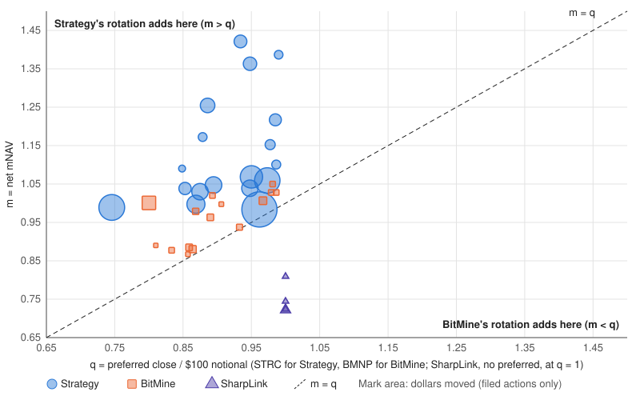

# Strategy's STRC rotation sat on its adding side of the break-even line in 18 of 18 filed weeks; BitMine's BMNP rotation in 0 of 15

The ruler is Strategy's own net coins per share definition, applied to both firms, from the glossary in Strategy's 2026-08-24 FWP. Net coins N are coins held plus USD assets, less out-of-the-money convertible debt and preferred notional, converted to coins at the coin price. n is N per fully diluted share. m is net mNAV, the common share price over the net coin value per share: m = s / (p·n). q is the preferred's close over its $100 notional.

Issuing common adds to n while m is above 1; retiring preferred adds while q is below 1. Strategy's rotation sells common and retires STRC, so it adds while m > q: it stops adding when STRC trades above $100 × m. BitMine's rotation sells BMNP and buys back common, so it adds while m < q: it stops adding when BMNP trades below $100 × m. The line m = q is where both rotations add nothing.

At a net mNAV of 1.217 (week ending 2026-09-20), Strategy's STRC rotation adds net sats per share while STRC trades below $121.71. STRC closed at $98.51 on 2026-09-18 (q = 0.9851). At a net mNAV of 1.028 (week ending 2026-09-20), BitMine's BMNP rotation adds net ETH per share while BMNP trades above $102.81. BMNP closed at $97.91 on 2026-09-18 (q = 0.9791).

---

Closest weeks to the line: Strategy 2026-08-23, m 2.29% above q; BitMine 2026-08-23, m 0.53% above q. BitMine's estimated share count carries a known upward bias of up to 0.43% of S by 2026-09-20 (staked ETH costed as purchases), which raises m by the same proportion; removing it leaves m above q in every BitMine week.

Period: Strategy weeks ending 2026-05-31 to 2026-09-20 (18 filed dates, including the 2026-06-30 quarter-end holdings row); BitMine weeks ending 2026-06-14 to 2026-09-20 (15 weeks with a BMNP price; BMNP was issued 2026-06-10).

Sources: Strategy weekly 8-Ks and Q2 10-Q (EDGAR CIK 1050446); BitMine weekly 8-K releases and 10-Q (EDGAR CIK 1829311); Yahoo Finance daily closes for MSTR, STRC, STRK, STRF, STRD, BMNR and BMNP; CoinGecko BTC and ETH closes. Each week uses closes from the last US trading day on or before the week's end.

Labeled estimates: BitMine S is estimated between filings, anchored to the 10-Q share counts for 2026-05-31 and 2026-07-09, with unreported issuance estimated as the week's unexplained change in cash divided by the BMNR close. BitMine R is its stated cash and marketable securities, so it includes securities. The USD of each BitMine ETH purchase is units × that week's ETH close.

Page: https://rahilbhavan.github.io/dat-accretion/. Method: https://github.com/RahilBhavan/dat-accretion/blob/main/docs/methodology.md. Code and data: https://github.com/RahilBhavan/dat-accretion. Definition source: https://www.sec.gov/Archives/edgar/data/1050446/000119312526363557/d431748dfwp.htm.
