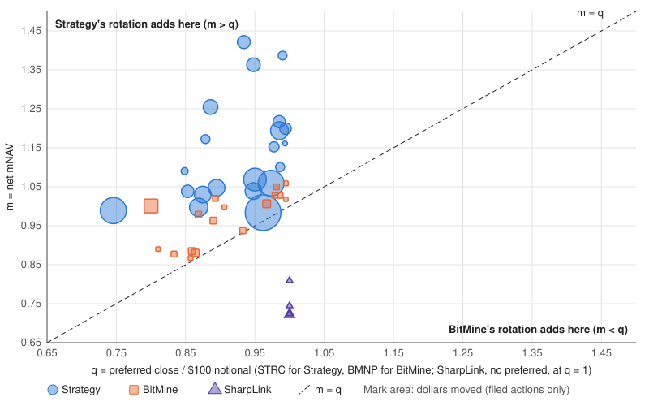

# At net mNAV 1.199, Strategy's STRC rotation adds net sats per share while STRC trades below $119.92; at 1.018, BitMine's BMNP rotation adds net ETH per share while BMNP trades above $101.77 (week ending 2026-10-04)

The ruler is Strategy's own net coins per share definition, applied to all three firms, from the glossary in Strategy's 2026-08-24 FWP. Net coins N are coins held plus USD assets, less out-of-the-money convertible debt and preferred notional, converted to coins at the coin price. n is N per fully diluted share. m is net mNAV, the common share price over the net coin value per share: m = s / (p·n). q is the preferred's close over its $100 notional.

Issuing common adds to n while m is above 1; retiring preferred adds while q is below 1. Strategy's rotation sells common and retires STRC, so it adds while m > q: it stops adding when STRC trades above $100 × m. BitMine's rotation sells BMNP and buys back common, so it adds while m < q: it stops adding when BMNP trades below $100 × m. The line m = q is where both rotations add nothing. SharpLink has no preferred, so no rotation line applies: issuing common adds while m > 1 and buying back common adds while m < 1.

At a net mNAV of 1.199 (week ending 2026-10-04), Strategy's STRC rotation adds net sats per share while STRC trades below $119.92. STRC closed at $99.41 on 2026-10-02 (q = 0.9941). At a net mNAV of 1.018 (week ending 2026-10-04), BitMine's BMNP rotation adds net ETH per share while BMNP trades above $101.77. BMNP closed at $99.48 on 2026-10-02 (q = 0.9948). SharpLink's net mNAV was 0.809 on its last filed date, 2026-08-03. SBET closed at $6.22 on 2026-08-03. SharpLink's filings state ETH holdings only on 2026-06-16, 2026-06-28, 2026-06-30, 2026-08-03. STRC closed below its break-even in 21 of 21 filed weeks, and BMNP closed below its break-even in 17 of 17. Strategy's rotation adds while STRC is below break-even; BitMine's adds while BMNP is above it. SharpLink's m was below 1 on 4 of 4 filed dates.

---

Closest weeks to the line: Strategy 2026-08-23, m 2.29% above q; BitMine 2026-08-23, m 0.53% above q. BitMine's estimated share count carries a known upward bias of up to 0.51% of S by 2026-10-04 (staked ETH costed as purchases), which raises m by the same proportion; removing it leaves m above q in every BitMine week.

Period: Strategy weeks ending 2026-05-31 to 2026-10-04 (21 filed dates, including the 2026-06-30 quarter-end holdings row); BitMine weeks ending 2026-06-14 to 2026-10-04 (17 weeks with a BMNP price; BMNP was issued 2026-06-10); SharpLink filed holdings dates 2026-06-16 to 2026-08-03 (4 dates; SharpLink states holdings only on those dates, and nothing is carried forward between them).

Sources: Strategy weekly 8-Ks and Q2 10-Q (EDGAR CIK 1050446); BitMine weekly 8-K releases and 10-Q (EDGAR CIK 1829311); SharpLink 8-K releases and Q2 10-Q (EDGAR CIK 1981535); Yahoo Finance daily closes for MSTR, STRC, STRK, STRF, STRD, BMNR, BMNP and SBET; CoinGecko BTC and ETH closes. Each week uses closes from the last US trading day on or before the week's end.

Labeled estimates: BitMine S is estimated between filings, anchored to the 10-Q share counts for 2026-05-31 and 2026-07-09, with unreported issuance estimated as the week's unexplained change in cash divided by the BMNR close. BitMine R is its stated cash and marketable securities, so it includes securities. The USD of each BitMine ETH purchase is units × that week's ETH close. SharpLink C includes LsETH and weETH at their stated as-if-redeemed ETH equivalence; its ETH change beyond stated purchases is inferred staking and LST accrual; its R is 2026-06-30 balance-sheet cash rolled by filed cash flows.

Page: https://rahilbhavan.github.io/dat-accretion/. Method: https://github.com/RahilBhavan/dat-accretion/blob/main/docs/methodology.md. Code and data: https://github.com/RahilBhavan/dat-accretion. Definition source: https://www.sec.gov/Archives/edgar/data/1050446/000119312526363557/d431748dfwp.htm.
